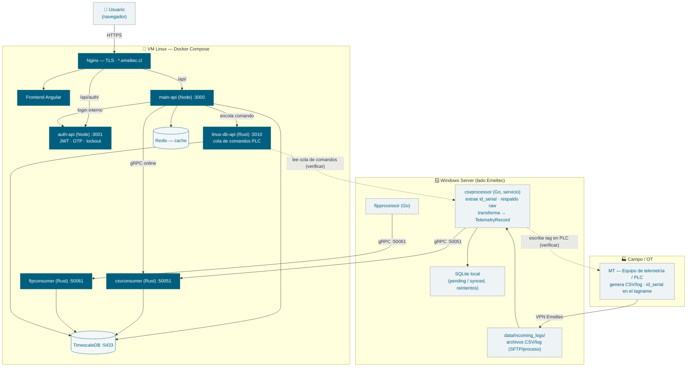

# Arquitectura y flujo de datos — Emeltec Cloud

Diagrama del recorrido del dato desde el equipo de telemetría (MT) hasta la
plataforma, y de la cadena de actuación (comandos PLC) de vuelta al equipo.

> Construido a partir del código y de los `ARCHITECTURE.md` de
> `grpc-pipeline/csvprocessor`, `csvconsumer-rust`, `main-api` y `auth-api`.
> Los tramos marcados con _(verificar)_ son supuestos a confirmar con operaciones.

## Diagrama

## Recorrido del dato (ingesta)

1. El **MT** (equipo de telemetría / PLC) genera archivos CSV/log; el `id_serial` viaja embebido en el _tagname_ (`151.20.35.10--1.AI23`).
2. Los archivos llegan al **Windows Server** por la **VPN de Emeltec** (SFTP / proceso externo) a `data/incoming_logs/`.
3. **csvprocessor (Go)** extrae el `id_serial`, respalda el raw por equipo, transforma a `TelemetryRecord`, lo guarda en **SQLite local** (estado `pending`) y lo envía por **gRPC** al consumidor.
4. **csvconsumer (Rust)** en la VM Linux recibe los lotes por gRPC (`:50051`) e inserta en **TimescaleDB**. (`ftpconsumer` :50061 hace lo análogo para el pipeline FTP.)
5. Si el envío gRPC falla, el registro queda `pending` en SQLite y un loop lo reintenta; los archivos que fallan 3 veces pasan a `failed_logs`.

## Recorrido del dato (consulta / web)

- El **usuario** entra por **Nginx** (TLS, subdominios `*.emeltec.cl`), que sirve el **frontend Angular** y enruta `/api/` → **main-api** y `/api/auth/` → **auth-api**.
- **main-api** lee **TimescaleDB**, usa **Redis** como caché de "online", valida sesión con **auth-api** (JWT) y consulta valores en vivo por **gRPC** a `csvconsumer`.

## Actuación (comando PLC)

- **main-api** encola un comando en **linux-db-api** (`:3010`). El consumidor de esa cola que lo escribe en el PLC debe confirmarse con operaciones _(verificar)_; el recorrido de vuelta llega al **MT**.

## Límites de seguridad (resumen)

- **Borde:** Nginx termina TLS y publica solo `*.emeltec.cl`; el resto de los servicios web están atados a `127.0.0.1` detrás del proxy.
- **Ingesta cross-host:** `csvconsumer`/`ftpconsumer`/`linux-db-api` reciben tráfico desde el Windows Server → se protegen por **firewall/NSG + (pendiente) auth/TLS gRPC** (ver `RUNBOOK-FASE-1`).
- **Autorización de datos:** todo acceso a telemetría por `id_serial`/sitio pasa por el control multi-tenant (`canAccessSite`).
