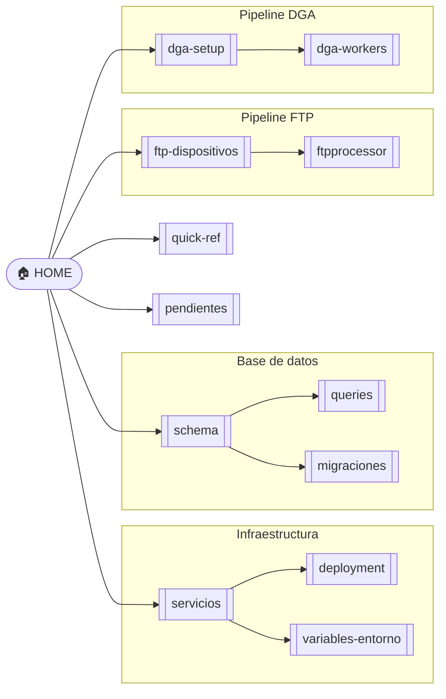
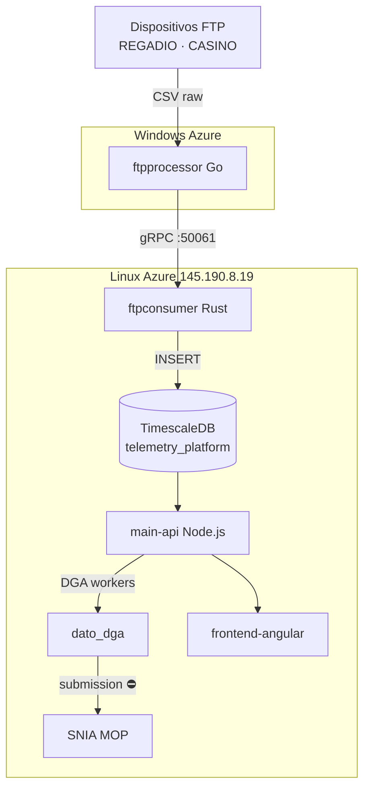

# Emeltec Cloud — Base de conocimiento

> [!abstract] Qué es este proyecto
> SaaS IIoT chileno para monitoreo industrial de agua, electricidad y procesos, con cumplimiento regulatorio DGA. Stack: Angular 21 + Node.js + TimescaleDB + Rust gRPC.

---

## Mapa del conocimiento

---

## Navegación por área

> [!info] Infraestructura
> - [[servicios]] — containers, puertos, arquitectura
> - [[deployment]] — deploy, migraciones, rollback
> - [[variables-entorno]] — .env, flags workers, secrets

> [!tip] Base de datos
> - [[schema]] — tablas, hypertables, continuous aggregates
> - [[queries]] — SQL frecuentes por categoría
> - [[migraciones]] — historial de cambios al schema

> [!example] Pipeline FTP
> - [[ftp-dispositivos]] — REGADIO / CASINO: datos, archivos pendientes, gotchas
> - [[ftpprocessor]] — servicio Go: parser, serial, gRPC

> [!example] Pipeline DGA
> - [[dga-setup]] — configurar sitio DGA, estado actual de pozos
> - [[dga-workers]] — preseed, fill, submission, reconciler

> [!tip] Referencia rápida
> - [[quick-ref]] — SSH, SQL inline, logs, ftpprocessor

> [!todo] Backlog
> - [[pendientes]] — tareas priorizadas FTP + DGA + deuda técnica

---

## Arquitectura de un vistazo

---

## Estado del sistema

> [!success] Datos en DB
> - **REGADIO** (25120112) Mayo 2026 → ~19,336 filas en `equipo`
> - **CASINO** (25120225) Mayo 2026 → ~730 filas en `equipo`

> [!warning] DGA — acción requerida
> - REGADIO (S131): solo 3 filas en `dato_dga` → verificar `dga_activo` en `pozo_config`
> - CASINO: sin `obra_dga` → no puede reportar a SNIA hasta que empresa obtenga código

> [!danger] Submission DGA deshabilitada
> `ENABLE_DGA_SUBMISSION_WORKER=false` — mantener hasta autorización de gerencia
