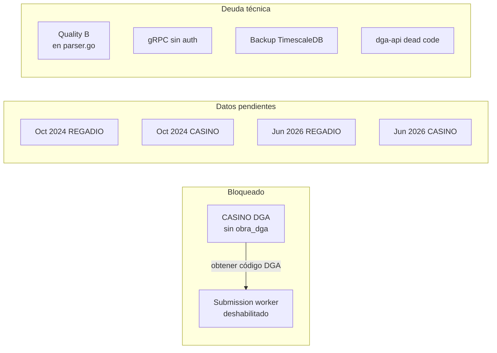

# Pendientes — Backlog priorizado

← [[HOME]] | Ver también: [[ftp-dispositivos]] · [[dga-setup]] · [[schema]] · [[servicios]] · [[quick-ref]]

---

## Resumen de estado



---

## FTP Pipeline

> [!todo] Cargar oct 2024 — REGADIO
> **Archivo:** `POZO REGADIO TD_log_20241008_20241022.csv` (~41,285 filas quality G)
> **Path local:** `C:\Users\cidm3\Downloads\datos`
> **Procedimiento:** [[ftp-dispositivos#Procedimiento — carga histórica]]
>
> ```powershell
> .\filter-ftp-month.ps1 -InputFile "POZO REGADIO TD_log_20241008_20241022.csv" `
>   -OutputFile "REGADIO_log_20241001_20241031.csv" `
>   -Year 2024 -Month 10 -RequireAllSensors
> ```

> [!todo] Cargar oct 2024 — CASINO
> **Archivo:** `POZO CASINO TD_log_20241004_20241022.csv` (~48,139 filas quality G)
> **Path local:** `C:\Users\cidm3\Downloads\datos`

> [!todo] Cargar jun 2026 — REGADIO
> **Archivo:** `REGADIO_log_20260506_20260609.csv` (cubre hasta 9 jun)
> **Nota:** abarca también inicio de mayo — verificar solapamiento con datos ya cargados.
>
> ```sql
> SELECT MIN(time), MAX(time) FROM equipo
> WHERE id_serial = '25120112' AND time >= '2026-05-01';
> ```

> [!todo] Cargar jun 2026 — CASINO
> **Archivo:** `CASINO_log_20260603_20260609_01.csv` (~29,366 filas quality G)

> [!bug] `failed_files: 1` en ftpprocessor
> Apareció en log al cargar CASINO. Causa desconocida.
> Verificar en Windows Server: logs de ftpprocessor en `bin/logs/`.

---

## DGA Pipeline

> [!danger] Configurar CASINO para DGA — bloqueado
> **Bloqueo:** sin código `obra_dga` (`OB-XXXX-XXX`) no se puede reportar a SNIA.
> **Pasos cuando llegue el código:**
>
> 1. Verificar que existe `sitio` con `id_serial='25120225'`
> 2. Verificar que existe `pozo_config` para ese sitio
> 3. Ejecutar SQL de [[dga-setup#SQL — configurar nuevo sitio (template CASINO)]]
> 4. Monitorear logs: `docker compose logs main-api --since 30m | grep dga`

> [!warning] Investigar REGADIO (S131) — solo 3 rows en `dato_dga`
> Probablemente `dga_activo=false` o config incompleta.
>
> ```sql
> SELECT dga_activo, dga_transport, dga_periodicidad,
>        dga_fecha_inicio, dga_hora_inicio, dga_informante_rut
> FROM pozo_config WHERE sitio_id = 'S131';
> ```
>
> Si `dga_activo=false`: cambiar a `true` y esperar ciclo de preseed (6h) o reiniciar worker.

> [!danger] Cutover DGA — deshabilitado hasta autorización
> `ENABLE_DGA_SUBMISSION_WORKER=false` en `~/emeltec3/.env` en prod.
> Cuando gerencia autorice:
>
> 1. Verificar `dga_transport='rest'` por pozo
> 2. Cambiar flag en `.env`
> 3. Redeploy: `bash scripts/deploy-production.sh`

---

## Deuda técnica

> [!bug] Quality B entra a DB — fix en `parser.go`
> **Impacto:** datos malos pueden llegar a slots DGA → `requires_review` en cascada.
> **Fix:** `ftp-pipeline/ftpprocessor/internal/parser/parser.go`
>
> ```go
> // En BuildTelemetryRecords, antes de agrupar:
> if row.Quality == "B" {
>     continue
> }
> ```

> [!warning] gRPC sin autenticación
> `ftpconsumer` expuesto en `0.0.0.0:50061` sin auth.
> Depende de NSG/firewall Azure como única barrera. Ver `docs/security-audit/`.

> [!warning] Backup automático TimescaleDB — no configurado
> Pendiente de auditoría de infraestructura.

> [!info] `dga-api/` — código muerto — limpiar
> `dga-api/dist/` referencia `dga_user` (dropeada mayo 2026).
> **No está en `docker-compose.yml`** — el pipeline DGA real vive en `main-api/src/modules/dga/`.
> Limpiar o archivar para evitar confusión.

---

## Infraestructura

> [!todo] Agregar filtro quality B en ftpprocessor
> Ver bug arriba — mismo fix.
> También actualizar tests de `parser_test.go` para cubrir el caso Quality B.
