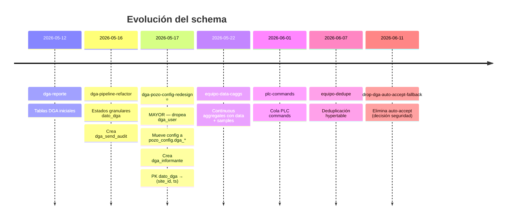

# Migraciones — Historial `telemetry_platform`

← [[HOME]] | Ver también: [[schema]] · [[deployment]] · [[dga-setup]]

---

## Historial completo

---

## Detalle por migración

> [!info] `2026-05-12-dga-reporte.sql`
> Crea tablas DGA iniciales. Primera versión del pipeline regulatorio.

> [!info] `2026-05-16-dga-pipeline-refactor.sql`
> - Extiende `dato_dga` con estados granulares (`vacio`, `pendiente`, `enviando`, `enviado`, `rechazado`, `fallido`)
> - Crea tabla `dga_send_audit` (append-only, audit trail)

> [!danger] `2026-05-17-dga-pozo-config-redesign.sql` — MIGRACIÓN MAYOR
> Cambios que rompieron compatibilidad con `dga-api/` (código muerto):
> - `DROP TABLE dga_user` → reemplazada por `pozo_config.dga_*` + `dga_informante`
> - `dato_dga` PK cambia de `(id_dgauser, ts)` a `(site_id, ts)`
> - Todo código que referencie `dga_user` está **roto**

> [!info] `2026-05-22-equipo-data-caggs.sql`
> Crea continuous aggregates `equipo_1min`, `equipo_5min`, `equipo_hourly`, `equipo_daily` con campo `data` JSONB y contador `samples`.

> [!info] `2026-06-01-plc-commands.sql`
> Crea tabla `plc_commands` — cola de comandos para dispositivos PLC via `linux-db-api`.

> [!info] `2026-06-07-equipo-dedupe.sql`
> Agrega deduplicación en hypertable `equipo` para evitar registros duplicados por reintentos del ftpconsumer.

> [!info] `2026-06-11-drop-dga-auto-accept-fallback.sql`
> Elimina lógica de auto-accept en slots DGA. Decisión de seguridad: datos `requires_review` requieren revisión manual explícita.

---

## Cómo aplicar una nueva migración

Ver [[deployment#Aplicar migración SQL manualmente]].
