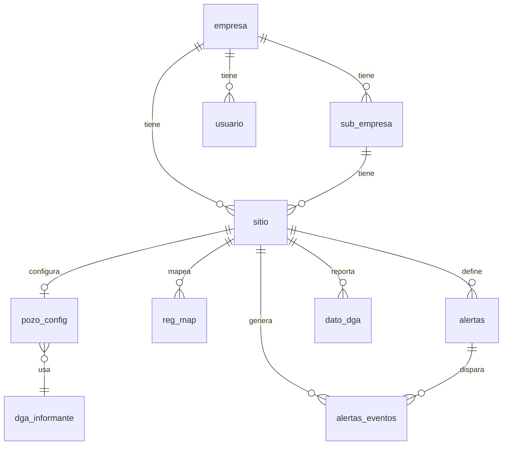
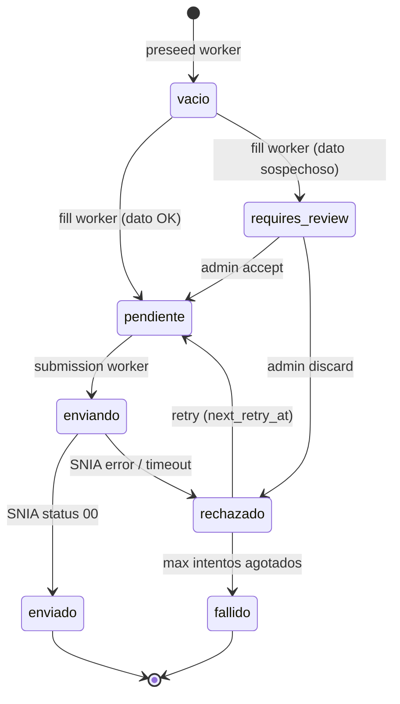

# Schema — `telemetry_platform`

← [[HOME]] | Ver también: [[servicios]] · [[dga-setup]] · [[ftp-dispositivos]]

TimescaleDB (PostgreSQL 16). Container `emeltec-db`, puerto `127.0.0.1:5433`.

---

## Mapa relacional



---

## Grupo: Entidades base

> [!info] `empresa`
>
> ```sql
> id           VARCHAR(10) PK
> nombre       VARCHAR(150)
> rut          VARCHAR(20) UNIQUE
> tipo_empresa VARCHAR(50)   -- 'Agua' | 'Riles' | 'Proceso' | 'Eléctrico'
> ```

> [!info] `sub_empresa`
>
> ```sql
> id         VARCHAR(10) PK
> nombre     VARCHAR(150)
> empresa_id FK → empresa
> ```

> [!info] `sitio`
>
> ```sql
> id          VARCHAR(10) PK    -- ej. 'S131', 'S225'
> descripcion VARCHAR(255)
> id_serial   VARCHAR(50)       -- key link con equipo.id_serial → ej. '25120112'
> empresa_id  FK → empresa
> tipo_sitio  VARCHAR(30)       -- 'pozo' | 'canal' | ...
> activo      BOOLEAN
> ```

> [!info] `usuario`
>
> ```sql
> id        VARCHAR(10) PK
> email     VARCHAR(150) UNIQUE
> tipo      VARCHAR(30)   -- 'SuperAdmin' | 'Admin' | 'Cliente' | 'Vendedor'
> auth_mode VARCHAR(20)   -- 'password' | 'otp' | 'password_otp'
> failed_logins  INTEGER
> locked_until   TIMESTAMPTZ
> ```

---

## Grupo: Configuración de pozos

> [!example] `pozo_config`
>
> ```sql
> sitio_id               VARCHAR(10) PK FK → sitio
> profundidad_pozo_m     NUMERIC
> profundidad_sensor_m   NUMERIC
> nivel_estatico_manual_m NUMERIC
> obra_dga               VARCHAR(80)   -- código DGA: 'OB-XXXX-XXX'
> slug                   VARCHAR(120)
>
> -- Columnas DGA (migración 2026-05-17)
> dga_activo             BOOLEAN DEFAULT FALSE
> dga_transport          VARCHAR(10)   -- 'off' | 'shadow' | 'rest'
> dga_periodicidad       VARCHAR(10)   -- 'hora' | 'dia' | 'semana' | 'mes'
> dga_fecha_inicio       DATE
> dga_hora_inicio        TIME          -- DEBE ser HH:MM:00 (sin segundos)
> dga_informante_rut     FK → dga_informante
> dga_caudal_max_lps     NUMERIC(10,2) -- derecho de agua según CPA DGA
> dga_caudal_tolerance_pct NUMERIC DEFAULT 20
> dga_max_retry_attempts SMALLINT DEFAULT 7
> dga_last_run_at        TIMESTAMPTZ
> ```

> [!example] `reg_map`
>
> ```sql
> id            VARCHAR(20) PK
> alias         VARCHAR(100)     -- nombre legible
> d1            VARCHAR(20)      -- key en equipo.data JSON  ej. 'Flujo Insta'
> d2            VARCHAR(20)      -- segundo key (totalizador word_swap)
> rol_dashboard VARCHAR(40)      -- 'caudal' | 'nivel_freatico' | 'totalizador' | 'generico'
> transformacion VARCHAR(40)
> parametros    JSONB            -- {word_swap, totalizator_offset, scale_factor}
> sitio_id      FK → sitio
> ```

---

## Grupo: Telemetría (series temporales)

> [!tip] `equipo` — hypertable principal
>
> ```sql
> time        TIMESTAMPTZ NOT NULL   -- columna partición (chunks 1 día)
> id_serial   VARCHAR(50)            -- device serial  ej. '25120112'
> data        JSONB                  -- {"Flujo Insta": 0.0, "Totalizado": 4915200, ...}
> received_at TIMESTAMPTZ
> ```
>
> - Compresión automática tras **7 días** (`compress_segmentby = 'id_serial'`)
> - Index: `(id_serial, time DESC)` + GIN en `data`

### Continuous Aggregates

| Vista           | Bucket | end_offset | Uso principal                      |
| --------------- | ------ | ---------- | ---------------------------------- |
| `equipo_1min`   | 1 min  | 2 min      | DGA fill worker, dashboard history |
| `equipo_5min`   | 5 min  | 10 min     | Contadores delta, gap analysis     |
| `equipo_hourly` | 1 hora | 1 hora     | Vistas medias, DGA horario         |
| `equipo_daily`  | 1 día  | 1 día      | Exports largos (meses/años)        |

> [!warning] Las continuous aggregates NO son real-time
> Datos recién insertados en `equipo` **no aparecen** en `equipo_1min` hasta ~2 min después.
> Para datos recientes siempre consultar `equipo` directamente.

---

## Grupo: DGA regulatorio

> [!example] `dato_dga`
>
> ```sql
> site_id             VARCHAR(10) PK FK → sitio   -- parte clave primaria
> ts                  TIMESTAMPTZ PK               -- parte clave primaria
> obra                VARCHAR(80)                  -- código obra DGA
> caudal_instantaneo  NUMERIC   -- L/s, 2 decimales
> flujo_acumulado     NUMERIC   -- m³, entero truncado
> nivel_freatico      NUMERIC   -- metros, 2 decimales
> estatus             VARCHAR   -- ver ciclo de vida
> comprobante         TEXT      -- número SNIA tras envío exitoso
> validation_warnings JSONB     -- warnings de validación
> fail_reason         TEXT
> next_retry_at       TIMESTAMPTZ
> intentos            SMALLINT DEFAULT 0
> ```

**Ciclo de vida de `estatus`:**



> [!info] `dga_informante`
>
> ```sql
> rut              VARCHAR(20) PK   -- RUT informante SNIA
> clave_informante TEXT             -- AES-256-GCM (DGA_ENCRYPTION_KEY)
> referencia       VARCHAR(150)     -- etiqueta libre interna
> ```

> [!info] `dga_send_audit` (append-only)
>
> ```sql
> id                  BIGSERIAL PK
> site_id             VARCHAR(10)
> ts                  TIMESTAMPTZ
> attempt_n           SMALLINT
> transport           VARCHAR   -- 'rest' | 'legacy-import'
> http_status         INTEGER
> dga_status_code     VARCHAR   -- '00' = OK
> api_n_comprobante   TEXT
> request_payload     JSONB     -- password redactado ****
> raw_response        JSONB
> sent_at             TIMESTAMPTZ
> duration_ms         INTEGER
> ```

---

## Grupo: Alertas e incidencias

> [!info] `alertas`
>
> ```sql
> sitio_id     FK → sitio
> variable_key VARCHAR(50)   -- campo en data JSON o 'dga_atrasado'
> condicion    VARCHAR       -- 'mayor_que'|'menor_que'|'fuera_rango'|'sin_datos'|'dga_atrasado'
> severidad    VARCHAR       -- 'baja'|'media'|'alta'|'critica'
> cooldown_minutos INTEGER DEFAULT 5
> ```

> [!info] `incidencias`
>
> ```sql
> sitio_id  FK → sitio
> estado    VARCHAR  -- 'abierta'|'en_progreso'|'resuelta'|'cerrada'
> gravedad  VARCHAR  -- 'leve'|'media'|'critica'
> origen    VARCHAR  -- 'terreno'|'remota'
> ```

> [!info] `plc_commands` (desde linux-db-api)
>
> ```sql
> command_id   VARCHAR PK
> id_serial    VARCHAR(50)
> command_type VARCHAR  -- 'write_tag' | 'write_tags'
> status       VARCHAR  -- 'pending'|'sent'|'done'|'failed'
> lease_until  TIMESTAMPTZ
> ```

---

## Historial de migraciones clave

> Ver queries SQL frecuentes en [[quick-ref]] · tareas pendientes de deuda técnica en [[pendientes]].

| Migración                                      | Cambio importante                                                                                                                   |
| ---------------------------------------------- | ----------------------------------------------------------------------------------------------------------------------------------- |
| `2026-05-12-dga-reporte.sql`                   | Crea tablas DGA iniciales                                                                                                           |
| `2026-05-16-dga-pipeline-refactor.sql`         | Extiende `dga_user`, `dato_dga` con estados granulares, crea `dga_send_audit`                                                       |
| **`2026-05-17-dga-pozo-config-redesign.sql`**  | **MAYOR**: mueve config DGA a `pozo_config.dga_*`, crea `dga_informante`, dropea `dga_user`, cambia PK `dato_dga` a `(site_id, ts)` |
| `2026-05-22-equipo-data-caggs.sql`             | Continuous aggregates con `data` y `samples`                                                                                        |
| `2026-06-01-plc-commands.sql`                  | Cola PLC commands                                                                                                                   |
| `2026-06-07-equipo-dedupe.sql`                 | Deduplicación hypertable                                                                                                            |
| `2026-06-11-drop-dga-auto-accept-fallback.sql` | Elimina auto-accept (decisión seguridad)                                                                                            |
