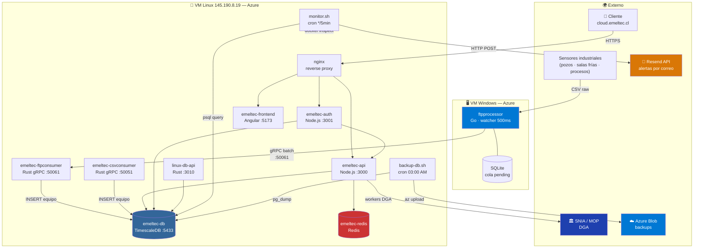
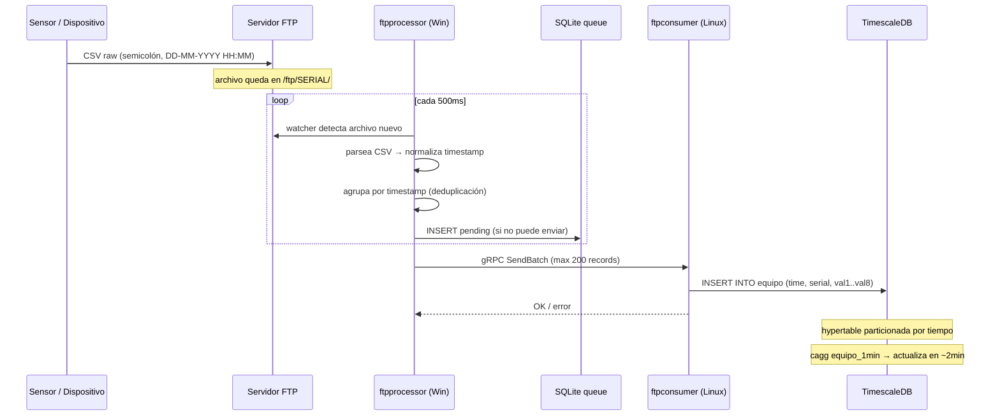
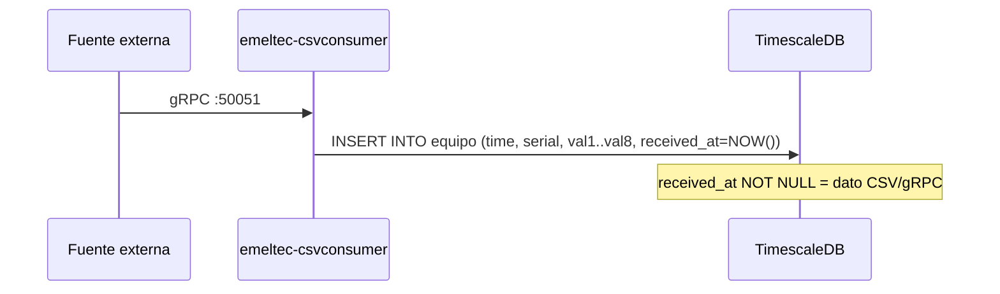
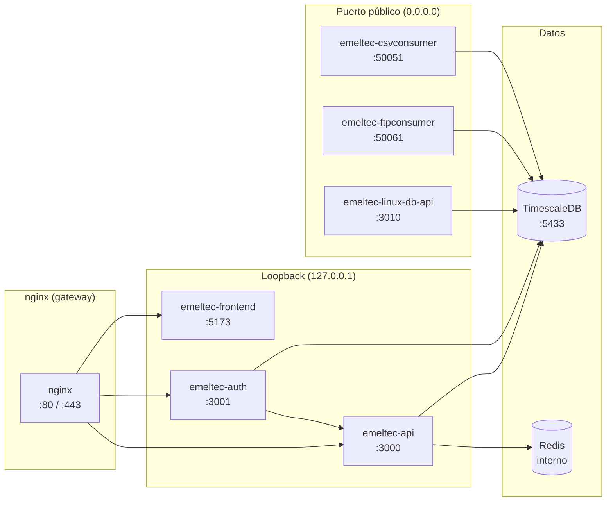
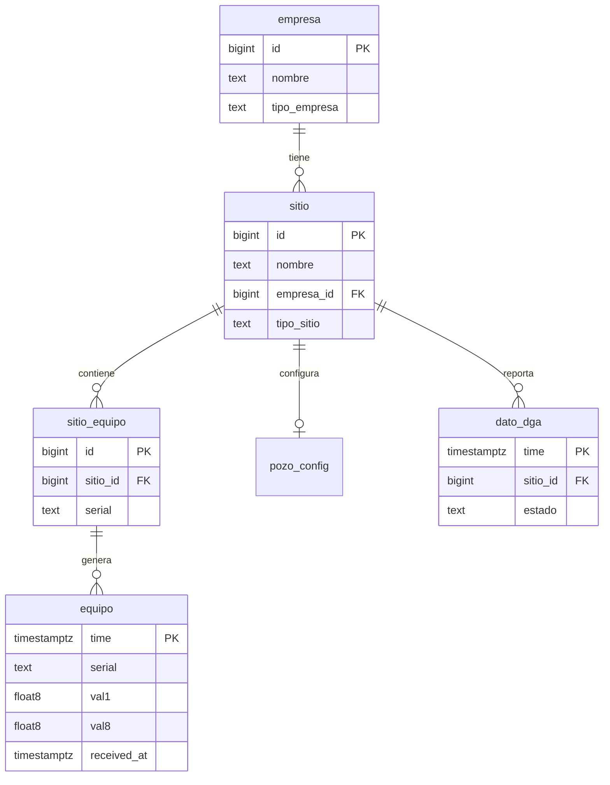
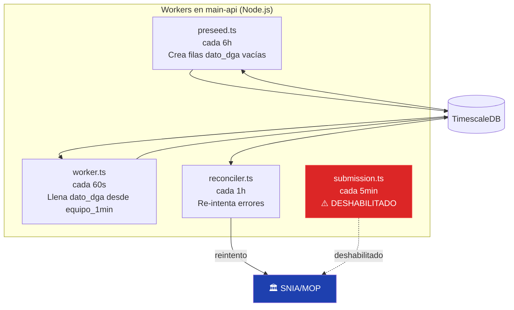
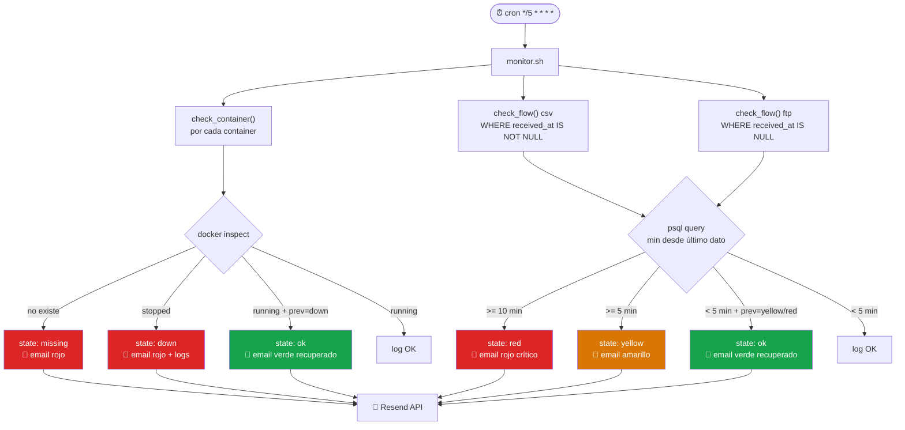
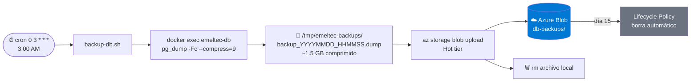

# Arquitectura General — Emeltec Cloud

← [[HOME]] | Ver también: [[servicios]] · [[monitor-alertas]] · [[backup-db]] · [[justificacion/infraestructura-cloud]]

---

## Vista de 30,000 pies

---

## Las dos pipelines de datos

### Pipeline FTP — sensores de campo

**Identificación:** `received_at IS NULL` en tabla `equipo` = dato FTP.

---

### Pipeline gRPC/CSV — csvconsumer

**Identificación:** `received_at IS NOT NULL` en tabla `equipo` = dato csvconsumer.

---

## Stack de contenedores Linux

> [!warning] Puertos públicos
> `50051`, `50061`, `3010` son accesibles desde internet — protegidos únicamente por NSG de Azure y autenticación interna (`x-internal-key`).

---

## Datos en la base de datos

---

## Pipeline DGA (dentro de main-api)

> [!danger] `submission.ts` deshabilitado
> `ENABLE_DGA_SUBMISSION_WORKER=false` — no cambiar sin autorización de gerencia.

---

## Sistema de monitoreo y alertas

**Anti-spam:** estado persistido en `/tmp/emeltec-monitor/` — solo manda email cuando el estado **cambia**.

---

## Sistema de backup

Costo: **$0.38/mes** — ver [[azure-blob-storage]].

---

## Resiliencia — qué pasa cuando algo falla

| Fallo | Detección | Recuperación automática | Pérdida de datos |
|---|---|---|---|
| Container cae | monitor.sh en <5 min → email | Docker restart policy | Ninguna |
| VM Linux cae | monitor.sh no puede correr | Manual: `docker compose up` | Ninguna (SQLite queue en Win) |
| ftpprocessor cae | monitor.sh → email | Manual | Datos en FTP server esperan |
| DB corrupta | monitor.sh → email | Restaurar desde backup | Máximo 24h |
| Red entre VMs cortada | ftpprocessor → SQLite queue | Auto-reenvío al reconectar | Ninguna |

---

## Archivos clave

| Archivo | Función |
|---|---|
| `scripts/monitor.sh` | Monitor de salud + alertas por email |
| `scripts/backup-db.sh` | Backup diario a Azure Blob |
| `docker-compose.yml` | Definición de todos los containers Linux |
| `infra-db/init-db/01-init-schema.sql` | Schema inicial de la DB |
| `infra-db/migrations/*.sql` | Cambios incrementales al schema (aplicar en orden) |
| `ftp-pipeline/ftpprocessor/` | Código Go del procesador FTP (Windows) |
| `ftp-pipeline/ftpconsumer-rust/` | Código Rust del receptor gRPC (Linux) |
| `grpc-pipeline/csvconsumer/` | Código Rust del consumer CSV/gRPC |
| `main-api/` | API principal Node.js + workers DGA |
