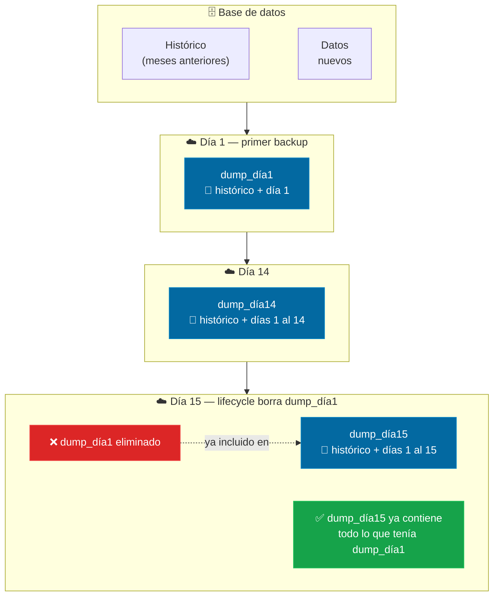
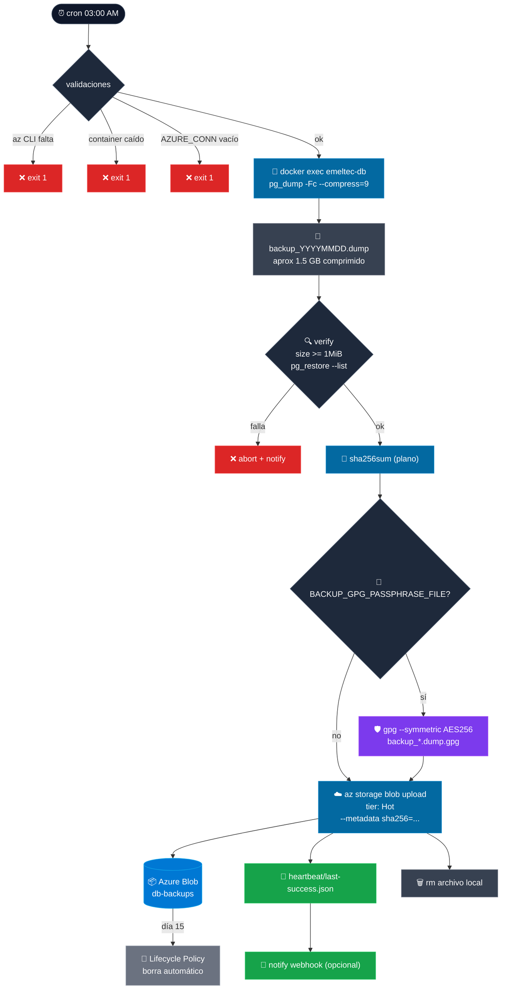
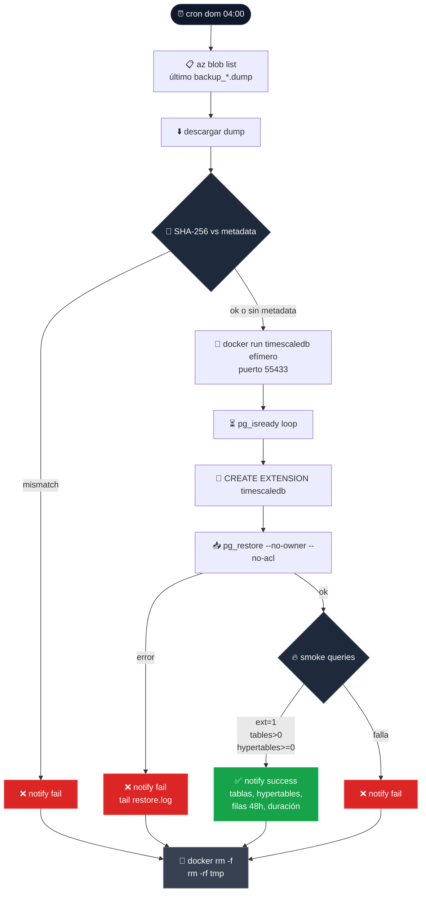

# Backup de base de datos — TimescaleDB → Azure Blob

← [[HOME]] | Ver también: [[servicios]] · [[deployment]] · [[variables-entorno]]

---

## Por qué borrar dumps viejos NO pierde datos históricos

Cada dump es una **foto completa** de toda la DB en ese momento — incluye todos los datos desde el primer día.



> Lo que se pierde con 14 días **no es historia** — es la capacidad de volver a un punto anterior a esos 14 días.

---

## Estrategia

`pg_dump -Fc --compress=9` diario a las 3 AM → Azure Blob Storage (Hot tier) → lifecycle policy borra automático a los 14 días.

**Por qué esta estrategia:**
- TimescaleDB es PostgreSQL-compatible, `pg_dump` funciona sin cambios
- `-Fc` comprime internamente con zlib (~5-10x para datos time-series) — no se necesita gzip externo
- Hot tier: sin mínimo de retención (Archive requiere 180 días mínimo, incompatible con 14 días)
- Retención fija: **14 días — no negociable**
- No se necesita WAL archiving continuo: `csvconsumer` y `ftpconsumer` tienen **cola SQLite persistente** (volumen `csvconsumer_wal`) antes de la DB. Si la DB cae 24 h, los datos de ingesta se encolan y reenvían al volver → RPO de telemetría ≈ 0 sin PITR.

**Frecuencia de dumps: diaria a las 03:00** (fija):

Motivo: **es un servicio 24/7 en producción**. `pg_dump` no bloquea escrituras (MVCC), pero genera ~90 s de I/O de disco + spike de CPU por la compresión zlib. En horario productivo eso agrega latencia a las queries del `main-api` y al pipeline gRPC de ingesta. A las 03:00 hay tráfico mínimo → ventana ideal para el spike.

RPO no-ingest resultante: **24 h** (aceptado como trade-off por evitar impacto en producción). Datos de telemetría (csvconsumer/ftpconsumer) tienen RPO ≈ 0 igualmente por la cola SQLite persistente.

Si en el futuro el negocio necesita RPO menor sin impactar horario productivo, la única salida sana es **PITR con `wal-g`** (ver alternativa futura al final de este doc): WAL streaming es continuo pero incremental — cada segmento son pocos MB, sin spike concentrado.

**Endurecimiento (2026-07-27):**
- **Verify post-dump**: `pg_restore --list` sobre el archivo antes de subir. Si falla, aborta y notifica.
- **Tamaño mínimo**: rechaza dumps < 1 MiB (proxy contra fallo mid-stream).
- **Checksum SHA-256**: calculado local, guardado como metadata del blob (`sha256`, `size_bytes`, `source_host`). Restore puede verificar integridad.
- **Heartbeat blob**: al terminar OK, escribe `heartbeat/last-success.json` con timestamp, tamaño, hash, duración. Alerta externa: si último heartbeat > 26 h → backup roto.
- **`trap ERR`**: cualquier fallo dispara `notify` con línea + últimas 20 líneas de log.
- **Webhook opcional**: si `BACKUP_WEBHOOK_URL` está definido en `.env`, se envía JSON en éxito y fallo.
- **Cifrado GPG opcional**: si `BACKUP_GPG_PASSPHRASE_FILE` está definido, el dump se cifra con AES-256 antes de subir. El blob queda `backup_TS.dump.gpg`, metadata incluye `encrypted=true`, `cipher=AES256`, `sha256_plain` (hash del dump antes del cifrado, para verificar post-descifrado).

---

## Flujo



---

## Script

`scripts/backup-db.sh` — lee credenciales de `.env` del servidor.

Variables requeridas en `.env`:

```env
POSTGRES_USER=postgres
POSTGRES_DB=telemetry_platform
AZURE_STORAGE_CONNECTION_STRING=DefaultEndpointsProtocol=https;AccountName=...
# Opcional — si está definida, se envía POST JSON en éxito y fallo
BACKUP_WEBHOOK_URL=https://hooks.slack.com/services/XXX/YYY/ZZZ
# Opcional — si está definida y apunta a un archivo legible, el dump se cifra con GPG AES-256 antes de subir
BACKUP_GPG_PASSPHRASE_FILE=/etc/emeltec/backup-gpg.pass
```

**Payload webhook**:
```json
{
  "service": "backup-db",
  "status": "success" | "fail",
  "host": "emeltec-linux",
  "file": "backup_20260727_030001.dump",
  "message": "...",
  "timestamp": "2026-07-27T06:00:00Z"
}
```

---

## Setup en el servidor (una sola vez)

### 1. Instalar az CLI

```bash
curl -sL https://aka.ms/InstallAzureCLIDeb | sudo bash
```

### 2. Crear Storage Account en Azure Portal

- Tipo: **Storage Account v2**
- Redundancia: **LRS** (zona única, suficiente para backup)
- Tier default: **Hot**

### 3. Obtener connection string

En Azure Portal → Storage Account → Access keys → Connection string

Agregar al `.env` del servidor:
```bash
AZURE_STORAGE_CONNECTION_STRING="DefaultEndpointsProtocol=https;AccountName=emeltec..."
```

### 4. Configurar Lifecycle Policy (versionada en git)

La regla vive en `deployment/azure/lifecycle-policy.json` (fuente de verdad). Aplica una acción sobre los blobs `db-backups/backup_*`:

| Edad | Acción |
|---|---|
| 14 días | Borrar |

**Por qué no usamos Cool tier**: Cool tier tiene retención mínima de 30 días. Con nuestra política de 14 días, mover a Cool a los 7 días genera un cargo de "early deletion" por los 23 días restantes, que en la práctica sale **más caro** que dejar todo en Hot. Cool solo tiene sentido si se extiende la retención a ≥ 30 días.

Aplicar / actualizar (una sola vez o cuando cambie el JSON):

```bash
az storage account management-policy create \
  --account-name "$STORAGE_ACCOUNT" \
  --resource-group "$RESOURCE_GROUP" \
  --policy @deployment/azure/lifecycle-policy.json
```

Ver `deployment/azure/README.md` para el flujo completo (diff, actualización, convención).

> [!warning] No editar la policy directo en el Portal. Editar el JSON versionado y publicar con `az`. Editar en el Portal genera deriva silenciosa.

### 5. Dar permisos al script

```bash
chmod +x /home/azureuser/emeltec3/scripts/backup-db.sh
```

### 6. Agregar cron

Diario a las 03:00 (horario sin tráfico productivo):

```bash
crontab -e
# Agregar:
0 3 * * * /home/azureuser/emeltec3/scripts/backup-db.sh >> /var/log/emeltec-backup.log 2>&1
```

> **No cambiar a mayor frecuencia sin evaluar impacto en producción.** El spike de I/O + CPU de `pg_dump` afecta latencia. Si se necesita menor RPO, ver "Alternativa futura — PITR con wal-g".

---

## Logs esperados

```
[2026-07-27 03:00:01] Iniciando pg_dump de 'telemetry_platform' (formato custom -Fc --compress=9)...
[2026-07-27 03:01:23] Dump generado: backup_20260727_030001.dump (1.4G, 1503238553 bytes)
[2026-07-27 03:01:24] Verificando integridad del dump...
[2026-07-27 03:01:31] Dump verificado OK.
[2026-07-27 03:01:32] SHA-256: 3f9c2a...e7b1
[2026-07-27 03:01:32] Subiendo a Azure Blob (Hot tier)...
[2026-07-27 03:02:47] Upload exitoso: backup_20260727_030001.dump (1.4G)
[2026-07-27 03:02:48] Heartbeat actualizado (heartbeat/last-success.json). Duración: 167s.
[2026-07-27 03:02:48] Backup completado. Retención 14 días gestionada por Azure Lifecycle Policy.
```

**Fallo**:
```
[2026-07-27 03:01:31] ERROR: pg_restore --list falló. Dump corrupto — abortando upload.
[2026-07-27 03:01:31] FALLO en línea 105 (exit=1)
```

---

## Restaurar

> [!warning] Restaurar sobreescribe la DB actual. Solo hacer en emergencia.

### Backup sin cifrar (`.dump`)

```bash
# 1. Descargar dump
az storage blob download \
  --connection-string "$AZURE_STORAGE_CONNECTION_STRING" \
  --container-name db-backups \
  --name backup_YYYYMMDD_HHMMSS.dump \
  --file restore.dump

# 2. Verificar integridad contra el hash guardado en metadata
EXPECTED=$(az storage blob show \
  --connection-string "$AZURE_STORAGE_CONNECTION_STRING" \
  --container-name db-backups \
  --name backup_YYYYMMDD_HHMMSS.dump \
  --query "metadata.sha256" -o tsv)
ACTUAL=$(sha256sum restore.dump | cut -d' ' -f1)
[ "$EXPECTED" = "$ACTUAL" ] || { echo "HASH MISMATCH — no restaurar"; exit 1; }

# 3. Crear extensión (TimescaleDB requiere esto primero)
docker exec -i emeltec-db psql -U postgres -c "CREATE EXTENSION IF NOT EXISTS timescaledb CASCADE;"

# 4. Restaurar
docker exec -i emeltec-db pg_restore -U postgres -d telemetry_platform -Fc < restore.dump
```

### Backup cifrado (`.dump.gpg`)

```bash
# 1. Descargar blob cifrado
az storage blob download \
  --connection-string "$AZURE_STORAGE_CONNECTION_STRING" \
  --container-name db-backups \
  --name backup_YYYYMMDD_HHMMSS.dump.gpg \
  --file restore.dump.gpg

# 2. Verificar hash del cifrado
EXPECTED_ENC=$(az storage blob show \
  --connection-string "$AZURE_STORAGE_CONNECTION_STRING" \
  --container-name db-backups \
  --name backup_YYYYMMDD_HHMMSS.dump.gpg \
  --query "metadata.sha256" -o tsv)
ACTUAL_ENC=$(sha256sum restore.dump.gpg | cut -d' ' -f1)
[ "$EXPECTED_ENC" = "$ACTUAL_ENC" ] || { echo "HASH cifrado MISMATCH"; exit 1; }

# 3. Descifrar
gpg --batch --decrypt \
    --passphrase-file /etc/emeltec/backup-gpg.pass \
    --output restore.dump \
    restore.dump.gpg

# 4. Verificar hash del plano
EXPECTED_PLAIN=$(az storage blob show \
  --connection-string "$AZURE_STORAGE_CONNECTION_STRING" \
  --container-name db-backups \
  --name backup_YYYYMMDD_HHMMSS.dump.gpg \
  --query "metadata.sha256_plain" -o tsv)
ACTUAL_PLAIN=$(sha256sum restore.dump | cut -d' ' -f1)
[ "$EXPECTED_PLAIN" = "$ACTUAL_PLAIN" ] || { echo "HASH plano MISMATCH"; exit 1; }

# 5. Restaurar como en el caso sin cifrar
docker exec -i emeltec-db psql -U postgres -c "CREATE EXTENSION IF NOT EXISTS timescaledb CASCADE;"
docker exec -i emeltec-db pg_restore -U postgres -d telemetry_platform -Fc < restore.dump

# 6. Borrar temporal
shred -u restore.dump restore.dump.gpg
```

### Verificar heartbeat (chequeo externo)

```bash
az storage blob download \
  --connection-string "$AZURE_STORAGE_CONNECTION_STRING" \
  --container-name db-backups \
  --name heartbeat/last-success.json \
  --file - | jq
```

Salida:
```json
{
  "last_success_utc": "2026-07-27T06:02:48Z",
  "backup_file": "backup_20260727_030001.dump",
  "size_bytes": 1503238553,
  "sha256": "3f9c2a...e7b1",
  "duration_seconds": 167,
  "host": "emeltec-linux"
}
```

Alerta sugerida: si `now - last_success_utc > 26h` → backup roto (cron corre cada 24 h, tolerancia +2 h).

---

## Cifrado GPG (opcional pero recomendado)

Cuando `BACKUP_GPG_PASSPHRASE_FILE` está definido en `.env` y apunta a un archivo legible, `backup-db.sh` cifra el dump con **GPG symmetric AES-256** antes de subirlo.

### Modelo de amenaza que mitiga

- Robo del Storage Account (leak de connection string, cuenta comprometida, exfiltración).
- Personal con acceso al blob pero sin autorización a datos productivos.
- Cumplimiento ("encryption at rest with customer-managed keys" para auditorías DGA / SOC2).

Sin cifrado el atacante que tenga la connection string puede descargar el `.dump` y correr `pg_restore` en cualquier Postgres → acceso completo a mediciones, tokens, configuración.

Con cifrado el blob es basura AES-256 sin la passphrase.

### Trade-offs

| Aspecto | Sin cifrado | Con GPG AES-256 |
|---|---|---|
| Restore | 1 paso | 2 pasos (descargar + `gpg --decrypt`) |
| Overhead cifrado | 0 | ~30 s sobre dump de 1.5 GB |
| Overhead tamaño | 0 | ~0 % (dump ya comprimido; `--compress-algo none`) |
| Riesgo perder passphrase | N/A | **Backup irrecuperable** — sin recovery |

> [!danger] Si perdés la passphrase, perdés el backup. GPG no tiene "olvidé mi clave". Guardala en al menos dos lugares independientes.

### Setup — una sola vez

**1. Generar passphrase fuerte** (fuera del server):

```bash
# En tu máquina local, no en el server
openssl rand -base64 48
# Ejemplo output: 8f3nB2p...q9Xa (64 chars alfanuméricos + símbolos)
```

**2. Guardar la passphrase en al menos DOS lugares independientes**:

- **1Password / Bitwarden**: como "Emeltec Backup GPG Passphrase" en la vault del equipo de infra.
- **Azure Key Vault** (segundo lugar, separado del Storage Account):
  ```bash
  az keyvault secret set \
    --vault-name emeltec-secrets \
    --name backup-gpg-passphrase \
    --value "<passphrase>"
  ```
- (Opcional, tercer lugar) impresa y guardada físicamente en un sobre sellado.

> Regla operativa: si el server se rompe y no está la passphrase → todos los backups se pierden. Redundancia obligatoria.

**3. Copiar la passphrase al server** en un archivo con permisos restrictivos:

```bash
# En el server, como root
sudo mkdir -p /etc/emeltec
sudo bash -c 'echo -n "<PASSPHRASE_AQUI>" > /etc/emeltec/backup-gpg.pass'
sudo chown azureuser:azureuser /etc/emeltec/backup-gpg.pass
sudo chmod 400 /etc/emeltec/backup-gpg.pass
```

- `chmod 400`: solo lectura para el owner. Nadie más.
- Path fuera del repo git (no commitear nunca).

**4. Agregar variable al `.env`**:

```env
BACKUP_GPG_PASSPHRASE_FILE=/etc/emeltec/backup-gpg.pass
```

**5. Instalar gpg si falta**:

```bash
sudo apt install -y gnupg
```

**6. Probar cifrado + descifrado manual antes de habilitar el cron**:

```bash
echo "hola mundo" > /tmp/test.txt
gpg --batch --yes --symmetric --cipher-algo AES256 \
    --passphrase-file /etc/emeltec/backup-gpg.pass \
    -o /tmp/test.txt.gpg /tmp/test.txt
gpg --batch --yes --decrypt \
    --passphrase-file /etc/emeltec/backup-gpg.pass \
    -o /tmp/test.decrypted /tmp/test.txt.gpg
diff /tmp/test.txt /tmp/test.decrypted && echo "GPG OK"
rm /tmp/test.*
```

**7. Correr un backup manual**:

```bash
./scripts/backup-db.sh
# Verificar en el log: "Cifrando con GPG symmetric AES-256..."
# En Azure Portal, el blob debería llamarse backup_TS.dump.gpg
```

### Metadata del blob cifrado

Además de las claves habituales, un blob cifrado agrega:

```
encrypted=true
cipher=AES256
sha256_plain=<hash del dump antes del cifrado>
size_bytes_plain=<tamaño del dump antes del cifrado>
```

El `sha256_plain` permite verificar la integridad **después** de descifrar durante un restore (detecta corrupción durante el proceso de descifrado).

### Migración a cifrado sin perder cobertura

Cuando se activa por primera vez:

1. Los backups nuevos serán `.dump.gpg`.
2. Los backups viejos (`.dump`) siguen legibles hasta que la lifecycle policy los borre (14 días).
3. Durante ese período la ventana de recuperación mezcla cifrados y sin cifrar. Sin problema — el restore detecta la extensión.
4. Después de 14 días, todos los backups son cifrados.

### Rotación de passphrase

- No rotamos con frecuencia (backups viejos quedarían inaccesibles si se rota antes de que expire su retención).
- Ventana correcta: rotar cada > 14 días (retención). Ideal: rotar en fecha calendarizada donde no haya restore inminente.
- Procedimiento: generar nueva passphrase, updatear los tres lugares de almacenamiento, updatear `/etc/emeltec/backup-gpg.pass` **al mismo tiempo** que el próximo backup arranca. Los backups viejos con la passphrase anterior quedan inaccesibles después de 14 días → guardar la passphrase vieja hasta que pase ese período.

---

## Verificación semanal automática (restore test)

> Un backup no probado no es un backup. Este job levanta un Postgres+TimescaleDB efímero, restaura el último dump y corre smoke queries. Si algo falla, notifica.

**Script**: `scripts/verify-backup.sh`

**Cron sugerido** (domingos 04:00, después del backup diario):
```bash
0 4 * * 0 /home/azureuser/emeltec3/scripts/verify-backup.sh >> /var/log/emeltec-verify.log 2>&1
```

### Flujo



### Qué valida

| Check | Cómo |
|---|---|
| Blob descargable | `az storage blob download` |
| Integridad del dump | `sha256sum` vs metadata `sha256` del blob |
| `pg_restore` no rompe | ejecuta contra Postgres+TimescaleDB efímero, exit code 0 |
| TimescaleDB carga | `SELECT count(*) FROM pg_extension WHERE extname='timescaledb'` = 1 |
| Estructura sobrevive | `information_schema.tables` con al menos 1 tabla en `public` |
| Hypertables presentes | `SELECT count(*) FROM timescaledb_information.hypertables` |
| Datos recientes (best-effort) | intenta contar filas de las últimas 48 h en la primera hypertable, buscando col `created_at`/`time`/`ts`/`timestamp` |

### Aislamiento

- Container efímero: `emeltec-verify-db` (nombre distinto al productivo `emeltec-db`).
- Puerto expuesto: `127.0.0.1:55433` — no interfiere con Postgres productivo.
- Password random por corrida (`verify_only_<epoch>`).
- Se autodestruye por `docker run --rm` + `trap EXIT`.
- Cero contacto con la DB productiva.

### Requisitos en el servidor

- `docker`, `az` CLI, `jq`, `sha256sum` (viene con coreutils).
- Imagen `timescale/timescaledb:latest-pg16` (se descarga la primera vez).
- Espacio libre en `/tmp`: ~2 GB para el dump y el data dir del container.

### Payload webhook

Mismo `BACKUP_WEBHOOK_URL` que backup-db.sh, `service` distinto:

```json
{
  "service": "verify-backup",
  "status": "success" | "fail",
  "host": "emeltec-linux",
  "file": "backup_20260727_030001.dump",
  "message": "verify-backup OK: file=... size=... tables=42 hypertables=3 recent_rows=180234 warnings=0 duration=185s",
  "timestamp": "2026-08-02T07:03:00Z"
}
```

### Correr manualmente

```bash
/home/azureuser/emeltec3/scripts/verify-backup.sh
```

---

## Pasos en Azure para implementar el endurecimiento + verify

> Ejecutar UNA sola vez cuando se despliegue el nuevo `backup-db.sh` + `verify-backup.sh` al servidor. Todo se puede hacer desde Azure Portal o `az` CLI local.

### 1. Confirmar que la connection string existente tiene permisos

El script usa `AZURE_STORAGE_CONNECTION_STRING` que ya está en `.env`. Ese string usa **Storage Account Key** → tiene permisos completos: `blob list`, `blob upload`, `blob show --query metadata`, `blob download`. **No hace falta cambiar nada.**

Si en el futuro se migra a SAS token, requiere: `Read`, `Write`, `List`, `Create` sobre el container `db-backups`.

### 2. Verificar que existe la Lifecycle Policy actual (14 días)

En Azure Portal → Storage Account → **Data management → Lifecycle management**:

- Debe haber una regla activa `delete-old-backups` que borre blobs con prefijo `backup_` a los 14 días.
- **Importante**: el prefijo del filtro es `db-backups/backup_` (no `backup_` solo), porque incluye el container name.
- Si no existe, crearla con este JSON (Portal → Add rule → Code view):

```json
{
  "rules": [{
    "name": "delete-old-backups",
    "enabled": true,
    "type": "Lifecycle",
    "definition": {
      "filters": {
        "blobTypes": ["blockBlob"],
        "prefixMatch": ["db-backups/backup_"]
      },
      "actions": {
        "baseBlob": {
          "delete": { "daysAfterModificationGreaterThan": 14 }
        }
      }
    }
  }]
}
```

> [!warning] El prefijo NO debe incluir `heartbeat/`. Si incluye `heartbeat/`, se borrará el archivo de salud cada 14 días y las alertas darán falsos positivos.

### 3. Excluir explícitamente el heartbeat de la lifecycle (opcional, por seguridad)

El heartbeat vive en `db-backups/heartbeat/last-success.json` y se sobreescribe cada día — no debería tocarlo la lifecycle. Pero para blindarlo, agregar segunda regla que excluya:

Actualmente Azure Lifecycle no soporta `NOT` en filtros — el filtro por prefijo `db-backups/backup_` ya excluye `heartbeat/` porque no matchea. Confirmar manualmente que el prefijo empieza con `backup_`, no con `` (vacío).

### 4. Confirmar quota / space en el Storage Account

- Actual: ~21 GB (14 días × 1.5 GB).
- Nuevo: idem — el heartbeat pesa < 1 KB. El verify-backup no sube nada nuevo (solo descarga).
- **Sin cambios de plan necesarios.**

### 5. (Opcional) Configurar webhook para notificaciones

Si querés recibir avisos:

**Slack**:
1. Slack → App → Incoming Webhooks → crear webhook para el canal `#emeltec-ops`.
2. Copiar URL (formato `https://hooks.slack.com/services/T.../B.../...`).
3. Agregar al `.env` del server: `BACKUP_WEBHOOK_URL=<url>`.

**Discord**:
1. Server settings → Integrations → Webhooks → New Webhook.
2. Copiar URL. Adaptar el JSON de payload si Discord rechaza el formato (Discord espera `content` o `embeds`; para eso hay que ajustar `notify()` en los scripts).

**Sin webhook**: los scripts corren igual y todo queda solo en el log local. Las alertas dependerían de un chequeo externo del blob `heartbeat/last-success.json`.

### 6. (Opcional) Alerta desde Azure Monitor sobre el heartbeat

Sin webhook propio, se puede alertar directo desde Azure:

- Storage Account → **Metrics** → agregar métrica `Availability` del blob `heartbeat/last-success.json`.
- Alternativa más precisa: Azure Function que corre cada hora, descarga `heartbeat/last-success.json`, parsea `last_success_utc`, si `now - last_success_utc > 26h` → dispara alerta a Action Group (email, SMS, webhook).
- Costo: ~$0 (Function consumption plan, ~720 ejecuciones/mes).

### Checklist final antes de habilitar el cron de verify-backup

- [ ] `git pull` en el server con la nueva versión de `backup-db.sh` y `verify-backup.sh`.
- [ ] `chmod +x scripts/verify-backup.sh`.
- [ ] Instalar `jq` si falta: `sudo apt install -y jq`.
- [ ] Instalar `gnupg` si se va a usar cifrado: `sudo apt install -y gnupg`.
- [ ] (Opcional cifrado) Generar passphrase, guardarla en 2+ lugares, escribir `/etc/emeltec/backup-gpg.pass` con `chmod 400`, agregar `BACKUP_GPG_PASSPHRASE_FILE` al `.env`. Ver "Cifrado GPG" arriba.
- [ ] Correr manual una vez: `./scripts/backup-db.sh` — verificar que la nueva versión sube metadata `sha256` + escribe `heartbeat/last-success.json` (y `.dump.gpg` si cifrado activo).
- [ ] Correr manual: `./scripts/verify-backup.sh` — verificar que descarga, descifra si corresponde, restaura en container efímero, y sale limpio.
- [ ] Confirmar que `emeltec-verify-db` fue eliminado al final (`docker ps -a | grep verify`).
- [ ] Agregar cron: `0 4 * * 0 /home/azureuser/emeltec3/scripts/verify-backup.sh >> /var/log/emeltec-verify.log 2>&1`.
- [ ] (Opcional) Setear `BACKUP_WEBHOOK_URL` en `.env`.
- [ ] Revisar lifecycle policy actual en Portal — confirmar prefijo `db-backups/backup_` (matchea tanto `.dump` como `.dump.gpg`).

---

## Costo estimado

| Concepto | Volumen | Precio | Subtotal |
|---|---|---|---|
| Dumps en Hot tier (14 días × 1/día × 1.5 GB) | ~21 GB | $0.018/GB/mes | $0.38/mes |
| Heartbeat blob | < 1 KB | — | ~$0 |
| Ops (upload, list, get metadata) | ~30/mes | despreciable | ~$0 |
| **Costo mensual** | | | **~$0.38/mes** |
| **Costo anual** | | | **~$4.56/año** |

Valor real del versionado en git: **no es ahorro, es reproducibilidad y auditoría**. Si mañana la policy desaparece del Portal (accidente, migración, error), reaplicar es un solo comando desde `deployment/azure/lifecycle-policy.json`.

Si en el futuro se extiende la retención a ≥ 30 días, entonces sí conviene sumar `tierToCool` a los 7 días.

---

## Alternativa futura — PITR con wal-g

> Documentada acá para no perder el análisis. **No implementada** hoy.

**Cuándo conviene**: si un análisis muestra que **6 h de RPO no alcanza** para datos no-ingest (usuarios, config, audit, digest, contadores). Esto sería el caso, por ejemplo, si un cliente pierde una config crítica en un cambio a las 12:05 y detecta el error a las 12:20 → el próximo dump es a las 18:00 → sí querés punto-en-el-tiempo antes de las 12:05, no un dump viejo de las 12:00.

**Qué es**:
Point-In-Time Recovery. Postgres emite archivos WAL (Write-Ahead Log) cada vez que ocurre un cambio. Con WAL archiving continuo → cada segment WAL (16 MB o cada 60 s, lo que llegue primero) se sube a Azure Blob. Restore = último **basebackup físico** + replay de WAL hasta el segundo exacto que se le pida.

RPO baja de **6 h → segundos**. RTO similar al actual (bajarse el basebackup + WAL, restaurar).

**Herramienta recomendada**: `wal-g` (Go, single binary, soporte Azure Blob nativo, más simple que pgBackRest).

**Diferencias con el sistema actual**:

| Aspecto | Hoy (`pg_dump`) | Con `wal-g` |
|---|---|---|
| Tipo | Lógico (portable, cross-version) | Físico (mismo Postgres, misma arch) |
| Frecuencia | Cada 6 h | Basebackup semanal + WAL continuo |
| RPO no-ingest | 6 h | Segundos |
| Restore | `pg_restore -Fc` | `wal-g backup-fetch` + `postgres` replay |
| Almacena en | `db-backups/backup_*.dump` | `db-backups-wal/basebackups_005/`, `wal_005/` |
| Costo storage | $1.51/mo | ~$1.90/mo (basebackup 4×/mes + WAL 14d) |
| Cambio en Postgres | Ninguno | `wal_level=replica`, `archive_mode=on`, `archive_command`, **restart requerido** |

> [!warning] `wal-g` es físico: el backup solo restaura en un Postgres con la **misma versión mayor** (16) y arquitectura (x86_64). No es portable entre versiones. Por eso conviene mantener `pg_dump` como backup lógico "de emergencia portable" incluso si se agrega wal-g.

### Cambios que requiere

1. **Extender imagen de la DB** (nuevo `infra-db/Dockerfile`):
   ```dockerfile
   FROM timescale/timescaledb:latest-pg16
   RUN apt-get update && apt-get install -y wget && \
       wget https://github.com/wal-g/wal-g/releases/latest/download/wal-g-pg-ubuntu-22.04-amd64.tar.gz -O /tmp/wal-g.tar.gz && \
       tar -xzf /tmp/wal-g.tar.gz -C /usr/local/bin && \
       chmod +x /usr/local/bin/wal-g-pg-ubuntu-22.04-amd64 && \
       ln -s /usr/local/bin/wal-g-pg-ubuntu-22.04-amd64 /usr/local/bin/wal-g && \
       rm /tmp/wal-g.tar.gz
   ```

2. **Modificar `docker-compose.yml`** — build local en vez de imagen upstream, montar dir de config wal-g, exponer env vars:
   ```yaml
   timescaledb:
     build: ./infra-db
     environment:
       WALG_AZ_PREFIX: azure://db-backups-wal
       AZURE_STORAGE_ACCOUNT: ${AZURE_STORAGE_ACCOUNT}
       AZURE_STORAGE_ACCESS_KEY: ${AZURE_STORAGE_ACCESS_KEY}
     command: >
       postgres
       -c wal_level=replica
       -c archive_mode=on
       -c archive_command='wal-g wal-push %p'
       -c archive_timeout=60
       ... (resto igual)
   ```
   **Restart obligatorio** (`archive_mode` requiere restart, no reload).

3. **Nuevo container blob**: `db-backups-wal` con lifecycle policy separada (14 días también, aplica a WAL segments y basebackups).

4. **Nuevo cron semanal** para basebackup:
   ```bash
   0 2 * * 0 docker exec emeltec-db wal-g backup-push /var/lib/postgresql/data >> /var/log/emeltec-basebackup.log 2>&1
   ```

5. **Retention job diario** para limpiar WAL viejos:
   ```bash
   0 5 * * * docker exec emeltec-db wal-g delete retain FIND_FULL 2 --confirm
   ```

6. **Nuevo script `scripts/restore-pitr.sh`** — helper para PITR.

7. **Doc actualizada** con procedimiento de PITR y test regular.

### Costo estimado

| Concepto | Volumen | Precio | Subtotal |
|---|---|---|---|
| Basebackups (2 × 1.5 GB, retención 14 d) | 3 GB | $0.018/GB/mes | $0.05/mo |
| WAL segments (~150 MB/día × 14 d) | ~2.1 GB | $0.018/GB/mes | $0.04/mo |
| pg_dump cada 6h (mantiene coexistir) | 84 GB | $0.018/GB/mes | $1.51/mo |
| Ops (WAL push cada 60 s) | ~40 k/mes | $0.005 / 10 k | $0.02/mo |
| Ops list/get durante restore | — | despreciable | ~$0 |
| **Total** | | | **~$1.62/mo** |

Diferencia real vs. actual: +$0.11/mo por RPO segundos + PITR.

**El obstáculo real no es la plata — es la complejidad operativa y el restart de DB productiva.**

---

## Alternativa futura — retención 30 días con tiering Cool

> Documentada acá para no perder el análisis. **No implementada** hoy.

**Cuándo conviene**: si el negocio exige poder volver más atrás en el tiempo (ej. un cliente descubre error de datos hace 20 días y pide reprocesar), o para cumplimiento regulatorio (DGA / auditorías) que pida > 14 días.

**Regla de lifecycle** (reemplazaría a `db-backups-lifecycle`):

```json
{
  "rules": [{
    "name": "db-backups-lifecycle",
    "enabled": true,
    "type": "Lifecycle",
    "definition": {
      "filters": {
        "blobTypes": ["blockBlob"],
        "prefixMatch": ["db-backups/backup_"]
      },
      "actions": {
        "baseBlob": {
          "tierToCool": { "daysAfterModificationGreaterThan": 7 },
          "delete":     { "daysAfterModificationGreaterThan": 30 }
        }
      }
    }
  }]
}
```

**Costo estimado** (30 días de historia):

| Concepto | Volumen | Precio | Subtotal |
|---|---|---|---|
| Dumps Hot (7 días × 1.5 GB) | 10.5 GB | $0.018/GB/mes | $0.19/mes |
| Dumps Cool (23 días × 1.5 GB) | 34.5 GB | $0.010/GB/mes | $0.35/mes |
| **Costo mensual** | | | **~$0.54/mes** |
| **Costo anual** | | | **~$6.48/año** |

**Trade-off**: +$0.16/mes (+42%) por **el doble de cobertura de recuperación** (30 días vs. 14).

**Impacto operativo**:
- Restore de dumps en Cool tier tarda un par de segundos más (rehidratación instantánea, no como Archive).
- `verify-backup.sh` toca solo el último dump → siempre en Hot → sin impacto.
- El costo de reads en Cool (por restore) es despreciable (< $0.01 por corrida).

**Cambios que requiere**:
1. Editar `deployment/azure/lifecycle-policy.json` con el bloque de arriba.
2. Re-aplicar la policy vía `az storage account management-policy create ...`.
3. Actualizar la sección de costo estimado.
4. Sin cambios en `backup-db.sh` ni `verify-backup.sh`.
