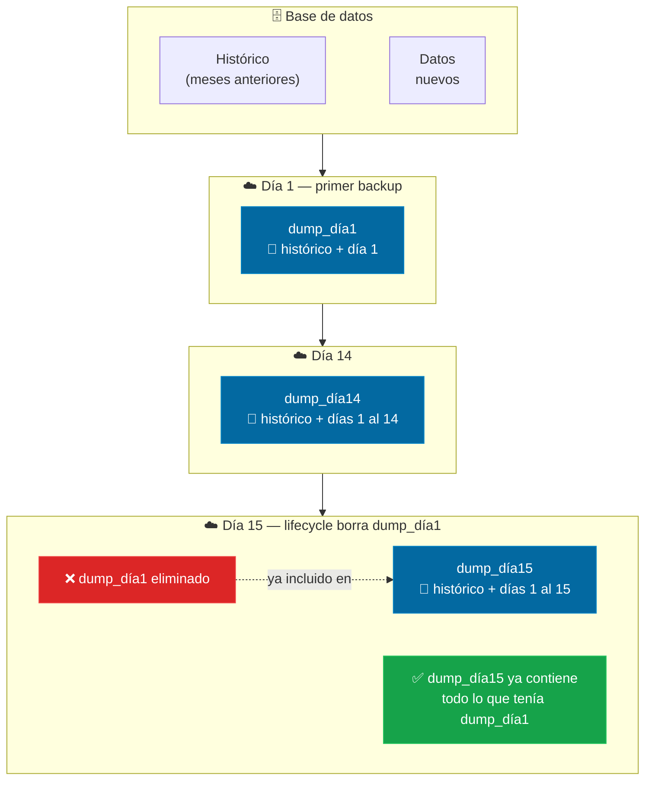
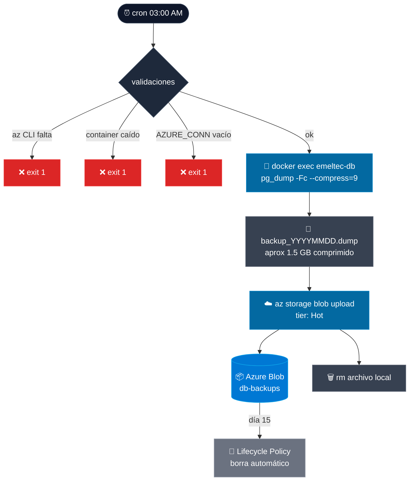

# Backup de base de datos — TimescaleDB → Azure Blob

← [[HOME]] | Ver también: [[servicios]] · [[deployment]] · [[variables-entorno]]

---

## Por qué borrar dumps viejos NO pierde datos históricos

Cada dump es una **foto completa** de toda la DB en ese momento — incluye todos los datos desde el primer día.



> Lo que se pierde con 14 días **no es historia** — es la capacidad de volver a un punto anterior a esos 14 días.

---

## Estrategia

`pg_dump -Fc --compress=9` diario a las 3 AM → Azure Blob Storage (Hot tier) → lifecycle policy borra automático a los 14 días.

**Por qué esta estrategia:**
- TimescaleDB es PostgreSQL-compatible, `pg_dump` funciona sin cambios
- `-Fc` comprime internamente con zlib (~5-10x para datos time-series) — no se necesita gzip externo
- Hot tier: sin mínimo de retención (Archive requiere 180 días mínimo, incompatible con 14 días)
- Costo: ~$0.38/mes (21 GB × $0.018/GB)
- No se necesita WAL archiving: ftpprocessor tiene cola SQLite con retry — si la DB cae, los datos se reenvían automáticamente cuando vuelve

---

## Flujo



---

## Script

`scripts/backup-db.sh` — lee credenciales de `.env` del servidor.

Variables requeridas en `.env`:

```env
POSTGRES_USER=postgres
POSTGRES_DB=telemetry_platform
AZURE_STORAGE_CONNECTION_STRING=DefaultEndpointsProtocol=https;AccountName=...
```

---

## Setup en el servidor (una sola vez)

### 1. Instalar az CLI

```bash
curl -sL https://aka.ms/InstallAzureCLIDeb | sudo bash
```

### 2. Crear Storage Account en Azure Portal

- Tipo: **Storage Account v2**
- Redundancia: **LRS** (zona única, suficiente para backup)
- Tier default: **Hot**

### 3. Obtener connection string

En Azure Portal → Storage Account → Access keys → Connection string

Agregar al `.env` del servidor:
```bash
AZURE_STORAGE_CONNECTION_STRING="DefaultEndpointsProtocol=https;AccountName=emeltec..."
```

### 4. Configurar Lifecycle Policy (14 días)

En Azure Portal → Storage Account → Data management → Lifecycle management → Add rule:

```json
{
  "rules": [{
    "name": "delete-old-backups",
    "type": "Lifecycle",
    "definition": {
      "filters": { "blobTypes": ["blockBlob"], "prefixMatch": ["db-backups/backup_"] },
      "actions": { "baseBlob": { "delete": { "daysAfterModificationGreaterThan": 14 } } }
    }
  }]
}
```

### 5. Dar permisos al script

```bash
chmod +x /home/azureuser/emeltec3/scripts/backup-db.sh
```

### 6. Agregar cron

```bash
crontab -e
# Agregar:
0 3 * * * /home/azureuser/emeltec3/scripts/backup-db.sh >> /var/log/emeltec-backup.log 2>&1
```

---

## Logs esperados

```
[2026-07-26 03:00:01] Iniciando pg_dump de 'telemetry_platform' (formato custom -Fc --compress=9)...
[2026-07-26 03:01:23] Dump generado: backup_20260726_030001.dump (1.4G)
[2026-07-26 03:01:23] Subiendo a Azure Blob (Hot tier)...
[2026-07-26 03:02:47] Upload exitoso: backup_20260726_030001.dump (1.4G)
[2026-07-26 03:02:47] Backup completado. Retención 14 días gestionada por Azure Lifecycle Policy.
```

---

## Restaurar

> [!warning] Restaurar sobreescribe la DB actual. Solo hacer en emergencia.

```bash
# 1. Descargar dump
az storage blob download \
  --connection-string "$AZURE_STORAGE_CONNECTION_STRING" \
  --container-name db-backups \
  --name backup_YYYYMMDD_HHMMSS.dump \
  --file restore.dump

# 2. Crear extensión (TimescaleDB requiere esto primero)
docker exec -i emeltec-db psql -U postgres -c "CREATE EXTENSION IF NOT EXISTS timescaledb CASCADE;"

# 3. Restaurar
docker exec -i emeltec-db pg_restore -U postgres -d telemetry_platform -Fc < restore.dump
```

---

## Costo estimado

| Concepto | Valor |
|---|---|
| Dumps en storage (máx 14 días × ~1.5 GB) | ~21 GB |
| Precio Hot tier | $0.018/GB/mes |
| **Costo mensual** | **~$0.38/mes** |
| **Costo anual** | **~$4.56/año** |
