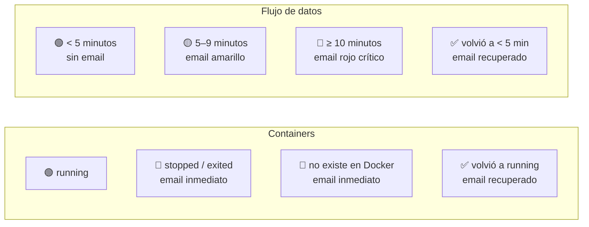
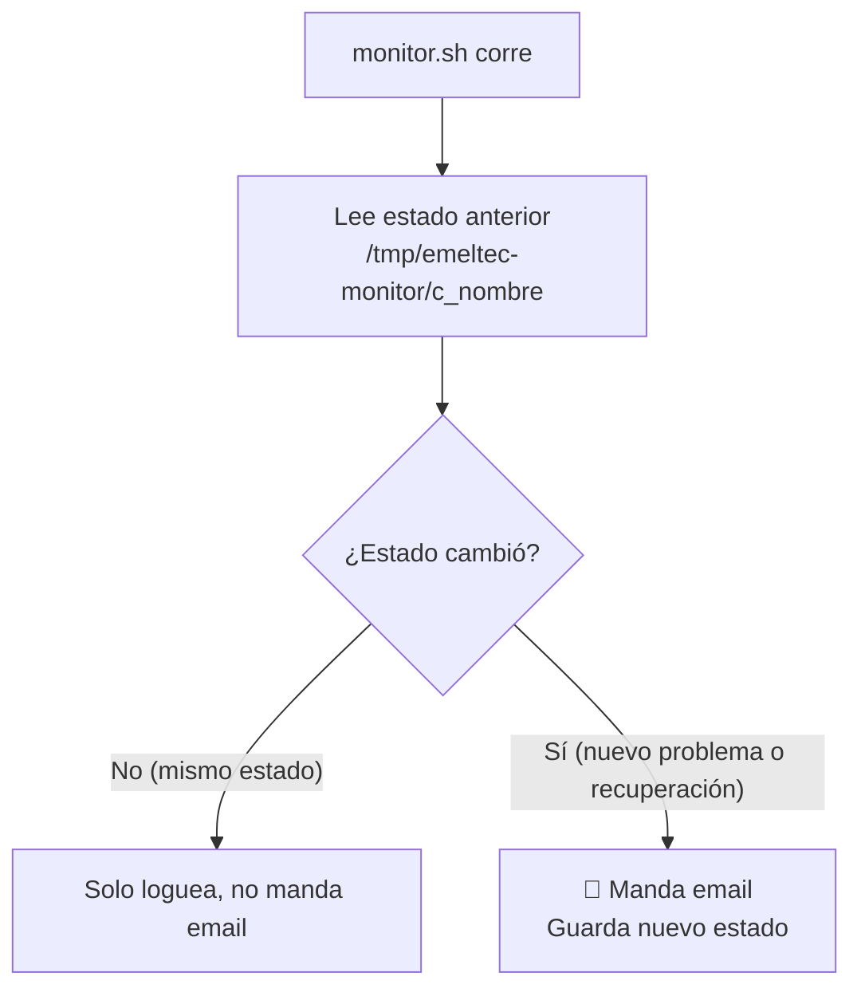

# Monitor de Alertas — monitor.sh

← [[HOME]] | Ver también: [[arquitectura-general]] · [[servicios]] · [[deployment]]

---

## Qué hace

Corre cada 5 minutos vía cron. Verifica:

1. **Estado de 8 containers Docker** — si alguno cae, manda email con los últimos logs
2. **Flujo de datos FTP pipeline** — si no llegan datos nuevos en >5 min, alerta
3. **Flujo de datos gRPC/CSV pipeline** — ídem

Si el estado no cambió desde la última vez, **no manda email** (anti-spam).

---

## Niveles de alerta



| Estado | Umbral | Color email | Acción sugerida |
|---|---|---|---|
| Container down | Inmediato al caer | Rojo | Ver logs en el email, reiniciar |
| Container missing | Inmediato | Rojo | Verificar docker-compose |
| Sin datos — alerta | 5 minutos | Amarillo | Revisar pipeline, puede auto-resolver |
| Sin datos — crítico | 10 minutos | Rojo | Revisar container + red + FTP server |
| Recuperado | Al volver a OK | Verde | Informativo, no requiere acción |

---

## Containers monitoreados

```
emeltec-db          TimescaleDB
emeltec-api         API principal
emeltec-linux-db-api Rust DB API
emeltec-redis       Cache
emeltec-auth        Autenticación
emeltec-frontend    Frontend Angular
emeltec-csvconsumer gRPC consumer CSV
emeltec-ftpconsumer gRPC consumer FTP
```

---

## Cómo distingue las dos pipelines

Ambas guardan datos en la tabla `equipo`, pero con una diferencia:

| Pipeline | Query de monitoreo | Campo clave |
|---|---|---|
| gRPC/CSV | `WHERE received_at IS NOT NULL` | `MAX(received_at)` |
| FTP | `WHERE received_at IS NULL` | `MAX(time)` |

Si la DB está caída, omite los checks de flujo (ya se alertó por el container).

---

## Anti-spam — cómo funciona



**Estados posibles por clave:** `ok` · `yellow` · `red` · `down` · `missing`

Cada container tiene su archivo: `c_emeltec-db`, `c_emeltec-api`, etc.
Cada flujo tiene su archivo: `f_csv`, `f_ftp`.

---

## Email de reinicio — cuando la VM (o monitor.sh) vuelve

`/tmp` se limpia en cada boot de Ubuntu, así que el estado anti-spam
(`/tmp/emeltec-monitor/*`) desaparece con un reinicio de la VM. Sin esto,
`monitor.sh` volvería a correr en silencio tras un reinicio — nadie se
entera de que "todo se levantó" salvo revisando logs a mano.

`monitor.sh` guarda un heartbeat propio (`/tmp/emeltec-monitor/monitor-last-run`,
timestamp de cada corrida) y en la corrida siguiente compara contra el
heartbeat anterior. Si detecta que se perdió el estado, manda **un email
resumen inmediato** con el estado de los 8 containers + las 2 pipelines,
y la razón detectada:

| Señal detectada | Razón en el email |
|---|---|
| Sin heartbeat previo (primer arranque tras boot) | "Sin heartbeat de la corrida anterior..." |
| Heartbeat con contenido corrupto | "Heartbeat de la corrida anterior corrupto..." |
| Heartbeat viejo — hueco > 15 min entre corridas (3x el intervalo del cron) | "monitor.sh no corrió por N min (última corrida: ...)" |
| Además, si `uptime -s` muestra boot < 20 min | Se agrega: "VM reinició hace N min (boot: ...)" |

**Asunto:** `🔵 [MONITOR] monitor.sh arrancó — resumen de estado`

Este email es independiente de las alertas individuales por container —
si algún container quedó realmente caído tras el reinicio, sigue llegando
también su `🔴 [CAÍDO]` de siempre. El resumen solo agrega el panorama
completo + la razón, una sola vez por reinicio (se autolimita: la próxima
corrida ya tiene heartbeat reciente y no vuelve a dispararse).

---

## Destinatarios

```bash
# TEST — solo mcid mientras se prueba
TO_EMAILS=("mcid@emeltec.cl")

# Producción — descomentar cuando esté validado
# TO_EMAILS=("mcid@emeltec.cl" "nlira@emeltec.cl" "druiz@emeltec.cl")
```

---

## Cómo se ve un email de alerta

### 🔴 Container caído
- Asunto: `🔴 [CAÍDO] emeltec-api — exit 1`
- Contenido: nombre, estado, exit code, últimas 30 líneas de log

### 🟡 Datos lentos
- Asunto: `⚠️ [ALERTA] ftpconsumer (FTP pipeline) — sin datos 7 min`
- Contenido: cuánto lleva sin datos, timestamp del último dato, en cuántos minutos llega alerta roja

### 🔴 Datos críticos
- Asunto: `🔴 [CRÍTICO] csvconsumer (gRPC pipeline) — sin datos 12 min`
- Contenido: ídem + instrucción de acción

### ✅ Recuperado
- Asunto: `✅ [RECUPERADO] emeltec-api — running`
- Contenido: confirmación de que volvió a funcionar

---

## Deploy en el servidor Linux

```bash
# 1. El script ya está en el repo en scripts/monitor.sh

# 2. Dar permisos
chmod +x /home/azureuser/emeltec3/scripts/monitor.sh

# 3. Agregar cron (corre cada 5 minutos)
crontab -e
# Agregar esta línea:
*/5 * * * * /home/azureuser/emeltec3/scripts/monitor.sh >> /var/log/emeltec-monitor.log 2>&1
```

---

## Variables requeridas en .env

```env
RESEND_API_KEY=re_xxxxxxxx
RESEND_FROM=Emeltec Cloud <noreply@emeltec.cl>
POSTGRES_USER=postgres
POSTGRES_DB=telemetry_platform
```

Si `RESEND_API_KEY` está vacío, el script simula el envío y loguea el asunto (útil para testing).

---

## Logs esperados

```
[2026-07-24 09:00:01] === Monitor Emeltec — inicio ===
[2026-07-24 09:00:01] OK emeltec-db: running
[2026-07-24 09:00:01] OK emeltec-api: running
[2026-07-24 09:00:02] SKIP emeltec-api (ya alertado: down)
[2026-07-24 09:00:03] FLOW csv: 2m (level=ok, prev=ok, último=24/07/2026 08:58)
[2026-07-24 09:00:04] FLOW ftp: 7m (level=yellow, prev=ok, último=24/07/2026 08:53)
[2026-07-24 09:00:04] Email OK → mcid@emeltec.cl [⚠️ [ALERTA] ftpconsumer...]
[2026-07-24 09:00:04] === Monitor Emeltec — fin ===
```

**Tras un reinicio de VM** (heartbeat perdido):
```
[2026-07-24 09:00:01] === Monitor Emeltec — inicio ===
[2026-07-24 09:00:01] REINICIO DETECTADO: Sin heartbeat de la corrida anterior (perdido por reinicio de VM o primera corrida de monitor.sh). VM reinició hace 3 min (boot: 2026-07-24 08:57:02).
[2026-07-24 09:00:02] OK emeltec-db: running
...
[2026-07-24 09:00:05] Email OK → mcid@emeltec.cl [🔵 [MONITOR] monitor.sh arrancó — resumen de estado]
[2026-07-24 09:00:05] === Monitor Emeltec — fin ===
```

---

## Archivo en el repo

`scripts/monitor.sh` — leer credenciales de `.env` del servidor.

Cron en producción: `*/5 * * * *`
Log: `/var/log/emeltec-monitor.log`
