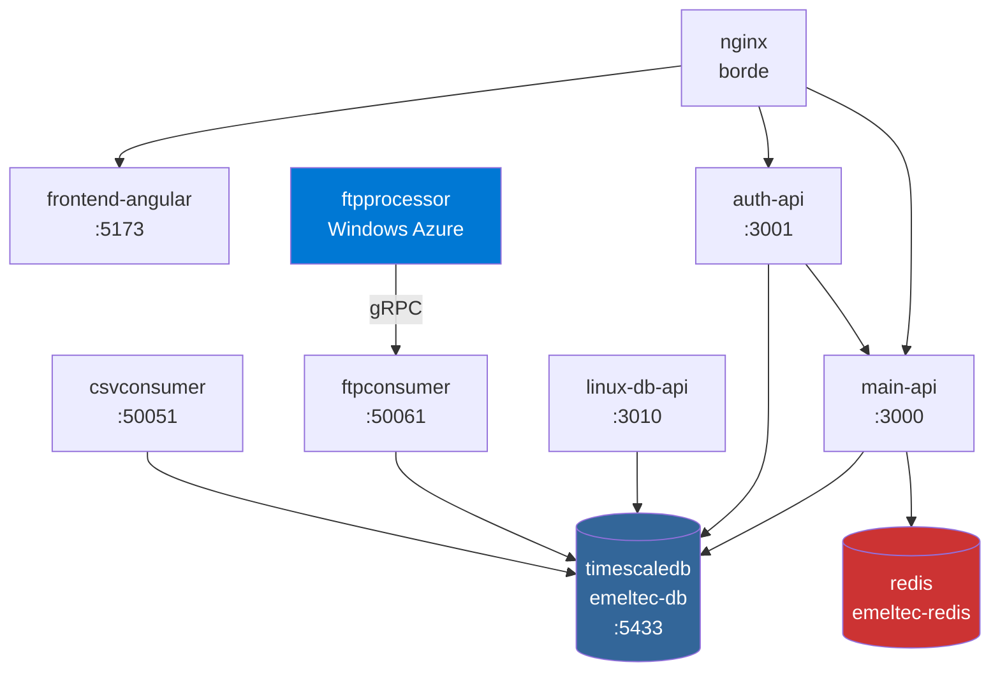
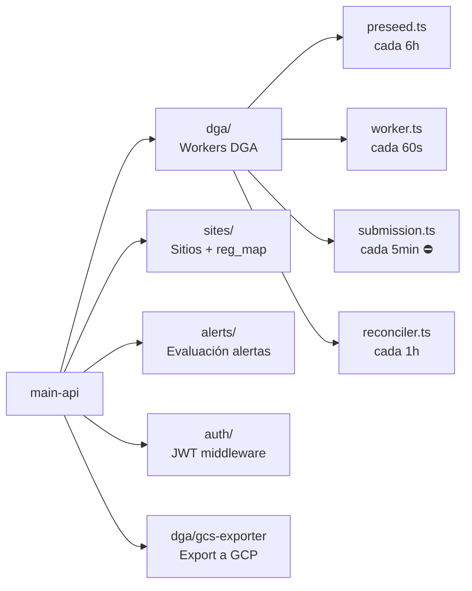
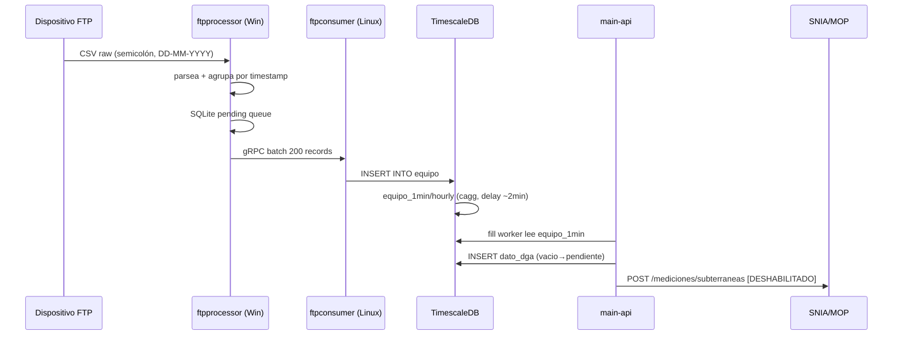

# Servicios — Mapa completo

← [[HOME]] | Ver también: [[schema]] · [[dga-setup]] · [[quick-ref]]

---

## Arquitectura de containers

---

## Tabla de containers

| Servicio | Container | Puerto | Tech | Función |
|---|---|---|---|---|
| `timescaledb` | `emeltec-db` | `127.0.0.1:5433` | PG16 + TimescaleDB | Base de datos |
| `main-api` | `emeltec-api` | `127.0.0.1:3000` | Node.js / TypeScript | API principal + DGA |
| `auth-api` | `emeltec-auth` | `127.0.0.1:3001` | Node.js | Auth, JWT, OTP |
| `linux-db-api` | `emeltec-linux-db-api` | `0.0.0.0:3010` | Rust (axum) | DB stats, PLC commands |
| `redis` | `emeltec-redis` | interno | Redis 7 | Cache |
| `frontend-angular` | `emeltec-frontend` | `127.0.0.1:5173` | Angular 21 | Web app |
| `metrics-page` | `emeltec-metrics-page` | `127.0.0.1:8081` | Static | Métricas |
| `landing-emeltec` | `emeltec-landing` | `127.0.0.1:8082` | Static | Landing |
| `csvconsumer` | `emeltec-csvconsumer` | `0.0.0.0:50051` | Rust gRPC | Ingesta CSV pipeline |
| `ftpconsumer` | `emeltec-ftpconsumer` | `0.0.0.0:50061` | Rust gRPC | Ingesta FTP pipeline → [[ftp-dispositivos]] |

> [!warning] Puertos públicos (0.0.0.0)
> `50051`, `50061`, `3010` son cross-host — deben estar protegidos por NSG/firewall de Azure.
> Los demás están detrás de nginx en loopback.

---

## Servicio Windows (VM separada)

> [!info] ftpprocessor
> - **Path:** `C:\Users\azureuser\Documents\serverwin\ftpprocessor\bin\`
> - **Tech:** Go
> - **Función:** Watcher 500ms → parsea CSV raw → agrupa por timestamp → SQLite pending → gRPC batch a Linux :50061
> - **Timeout gRPC:** 20 segundos

---

## main-api — módulos internos

### Workers DGA en main-api

| Worker | Archivo | Cadencia | Flag env | Default |
|---|---|---|---|---|
| Preseed | `preseed.ts` | 6 h | `ENABLE_DGA_PRESEED_WORKER` | `true` |
| Fill | `worker.ts` | 60 s | `ENABLE_DGA_WORKER` | `true` |
| Submission | `submission.ts` | 5 min | `ENABLE_DGA_SUBMISSION_WORKER` | **`false`** |
| Reconciler | `reconciler.ts` | 1 h | `ENABLE_DGA_RECONCILER` | `true` |

---

## linux-db-api — endpoints

| Endpoint | Método | Auth | Función |
|---|---|---|---|
| `/health` | GET | pública | Health check |
| `/api/db/usage` | GET | `x-internal-key` | Stats DB |
| `/api/plc/commands` | GET / POST | `x-internal-key` | Listar / crear comandos PLC |
| `/api/plc/commands/pending` | GET | `x-internal-key` | Tomar pendientes (lease) |
| `/api/plc/commands/:id/result` | POST | `x-internal-key` | Reportar resultado |

---

## Flujo de datos completo

---

## dga-api/ — NOTA IMPORTANTE

> [!danger] Código muerto — no usar
> `dga-api/dist/` referencia la tabla `dga_user` que fue **dropeada** en migración `2026-05-17`.
> El servicio **no está en `docker-compose.yml`**.
> El pipeline DGA real vive en `main-api/src/modules/dga/`.
> Ver tarea de limpieza en [[pendientes#Infraestructura]].
