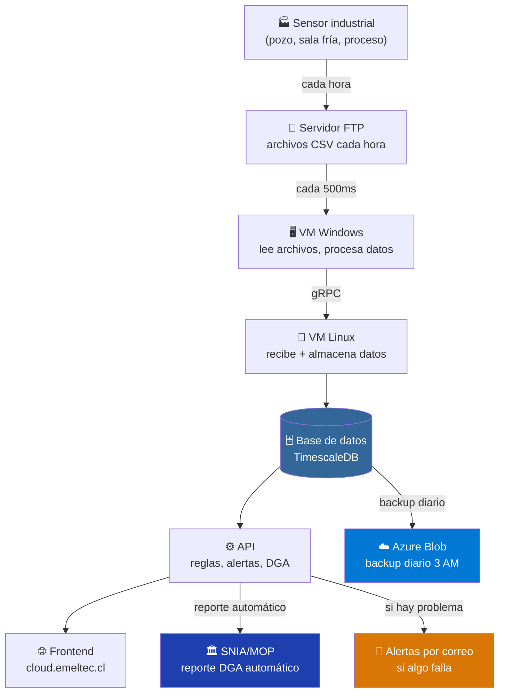
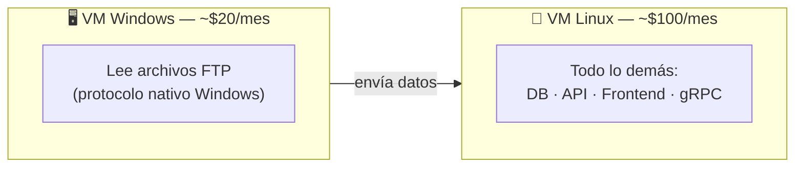
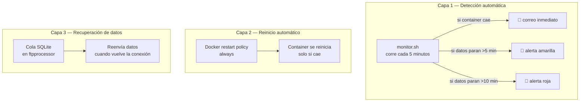

# Justificación — Infraestructura Cloud Emeltec

← [[HOME]] | Ver también: [[azure-blob-storage]] · [[arquitectura-general]] · [[servicios]]

---

## En una línea

Pagamos **~$120 USD/mes** para tener una plataforma IIoT que opera 24/7, recibe datos de sensores industriales en tiempo real, reporta automáticamente a la DGA, y alerta por correo si algo falla — sin intervención manual.

---

## El problema que resuelve

Los clientes tienen sensores industriales (pozos de agua, salas frías, procesos) que generan datos constantemente. Sin infraestructura:

- Los datos se pierden o quedan en planillas desconectadas
- Los reportes DGA se hacen manualmente (horas de trabajo por mes)
- No hay forma de saber si un sensor dejó de enviar datos hasta que el cliente llama

Con la infraestructura actual todo eso es automático.

---

## Qué hace el sistema sin intervención humana

---

## Por qué dos máquinas virtuales (no una)

| Motivo | Explicación |
|---|---|
| **Los sensores usan FTP** | Los dispositivos de campo solo saben hablar FTP. El software que lee esos archivos funciona mejor en Windows. |
| **Linux es más barato** | Para correr base de datos, API y web, Linux cuesta ~5× menos que Windows equivalente. |
| **Separación de responsabilidades** | Si el procesador de FTP falla, los datos ya almacenados en Linux siguen disponibles. |

---

## Por qué Docker (contenedores)

En vez de instalar todo directamente en el servidor:

| Sin Docker | Con Docker |
|---|---|
| "Funciona en mi máquina" | Funciona igual en dev, test y producción |
| Actualizar una cosa rompe otra | Cada servicio está aislado |
| Difícil de replicar | `docker compose up` levanta todo |
| Rollback manual complejo | Un comando vuelve a la versión anterior |

---

## Por qué TimescaleDB (no MySQL o SQL Server)

Los sensores generan **miles de filas por día**, indexadas por tiempo.

| Criterio | MySQL/SQL Server | TimescaleDB |
|---|---|---|
| Consultas por rango de fechas | Lento con millones de filas | Optimizado para esto |
| Compresión automática | No | Sí — reduce 90% el espacio |
| Agregaciones por hora/día | Manual | Automáticas (continuous aggregates) |
| Costo | Licencia cara (SQL Server) | Gratis (open source) |
| Compatibilidad | Estándar | 100% PostgreSQL — cualquier herramienta funciona |

---

## Qué pasa si algo falla

El sistema tiene tres capas de protección:

---

## Qué pasa si se cae el servidor

| Escenario | Tiempo de recuperación | Pérdida de datos |
|---|---|---|
| Container cae solo | ~30 segundos (auto-restart) | Ninguna (cola SQLite retiene) |
| VM Linux se cae y vuelve | ~3 minutos (docker compose up) | Ninguna (cola SQLite retiene) |
| Disco corrupto / VM destruida | ~30 minutos (restaurar backup) | Máximo 24 horas (último backup) |

---

## Costo mensual estimado

| Componente | Costo/mes | Qué cubre |
|---|---|---|
| VM Linux (B2s) | ~$35 | Todo el stack de producción |
| VM Windows (B1s) | ~$20 | Procesamiento FTP |
| Almacenamiento VMs | ~$8 | Discos de ambas VMs |
| Azure Blob (backups) | ~$0.38 | 14 copias diarias de la DB |
| Resend (emails) | $0 | Plan gratuito (100 emails/día) |
| **Total** | **~$63/mes** | Plataforma completa 24/7 |

> Para referencia: contratar un desarrollador para hacer esto manualmente costaría $2,000–$5,000/mes.

---

## Por qué Azure y no otro proveedor

| Factor | Azure | AWS | Google Cloud |
|---|---|---|---|
| Cuenta existente | ✅ Ya tenemos | ❌ Nueva cuenta | ❌ Nueva cuenta |
| Soporte en español | ✅ | Limitado | Limitado |
| Egress dentro del proveedor | $0 | $0.09/GB | $0.08/GB |
| Costo backup sin egress | $0.38/mes | ~$2.40/mes | ~$2.10/mes |
| Integración entre servicios | Nativa | Nativa | Nativa |

Cambiar de proveedor requeriría migrar todo, pagar egress, y gestionar nuevas cuentas — sin beneficio concreto para el negocio.

---

## Resumen ejecutivo

| Pregunta | Respuesta |
|---|---|
| ¿Cuánto cuesta por mes? | ~$63 |
| ¿Qué incluye? | Plataforma completa 24/7: datos, API, frontend, alertas, backups |
| ¿Hay intervención manual? | No. Todo es automático. |
| ¿Qué pasa si algo falla? | Llega un correo en menos de 5 minutos |
| ¿Se pierden datos si cae el servidor? | No. Cola local + backup diario. |
| ¿Por qué Azure? | Ya estamos ahí. Migrar no tiene beneficio. |
| ¿Qué pasa sin esta infra? | Datos perdidos, reportes DGA manuales, clientes sin plataforma. |
