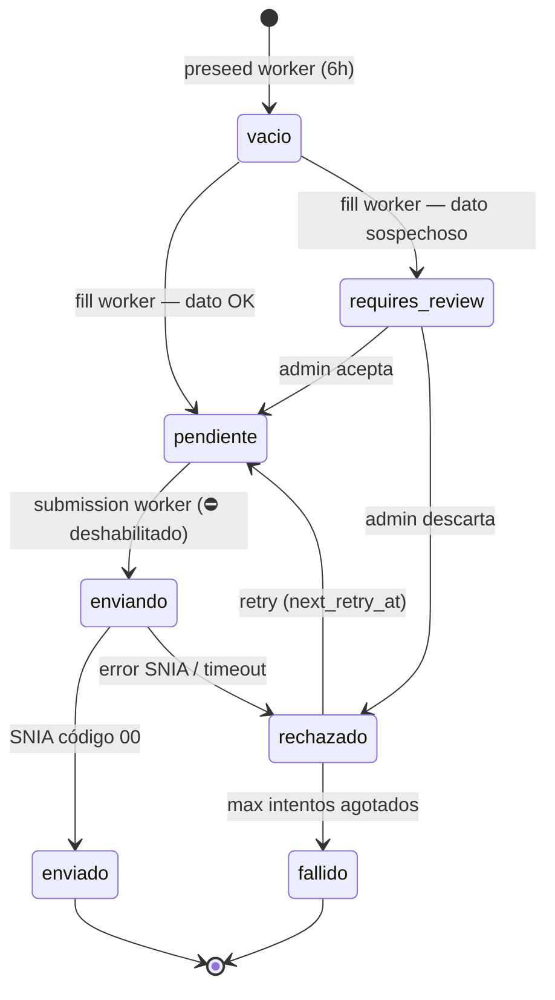
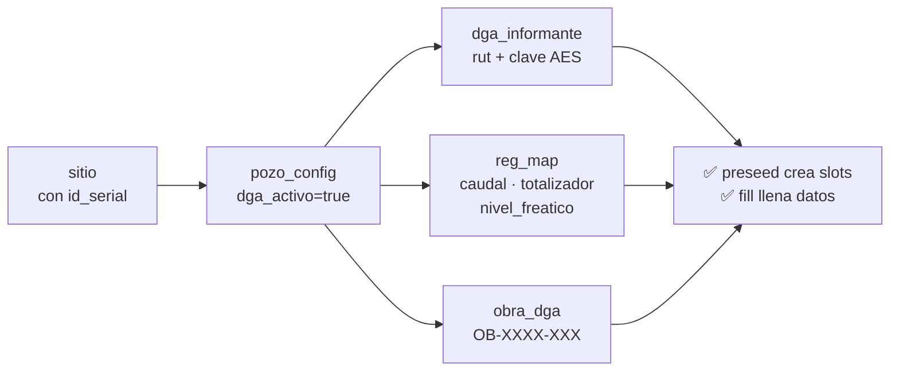

# DGA — Configuración y estado de pozos

← [[HOME]] | Ver también: [[schema]] · [[servicios]] · [[ftp-dispositivos]] · [[quick-ref]] | Fuente: [[../dga-reporte-proceso]]

---

## Ciclo de vida de un slot `dato_dga`



---

## Prerequisitos — qué necesita un sitio para generar `dato_dga`



> [!info] Los 4 requisitos de `pozo_config`
> | Campo | Tipo | Ejemplo |
> |---|---|---|
> | `dga_activo` | BOOLEAN | `true` |
> | `dga_periodicidad` | VARCHAR | `'hora'` · `'dia'` · `'semana'` · `'mes'` |
> | `dga_fecha_inicio` | DATE | `'2026-05-01'` |
> | `dga_hora_inicio` | TIME | `'00:00:00'` (sin segundos extra) |
> | `dga_informante_rut` | FK | `'12.345.678-9'` |
> | `obra_dga` | VARCHAR | `'OB-XXXX-XXX'` |

---

## Estado actual de los pozos

> [!warning] REGADIO (S131) — pocas filas en `dato_dga`
> - `sitio.id = S131` · `id_serial = 25120112`
> - `obra_dga` = configurada ✓
> - `dato_dga` = **solo 3 rows** — probablemente `dga_activo=false` o config incompleta
> - Verificar con SQL:
> ```sql
> SELECT dga_activo, dga_transport, dga_periodicidad,
>        dga_fecha_inicio, dga_hora_inicio, dga_informante_rut
> FROM pozo_config WHERE sitio_id = 'S131';
> ```

> [!danger] CASINO — sin `obra_dga`, sin slots DGA
> - `id_serial = 25120225` · `sitio.id` desconocido
> - `obra_dga` = **NO asignada** — bloqueo total hasta obtener código de DGA
> - `dato_dga` = **0 rows**
> - Acción requerida: empresa debe solicitar código `OB-XXXX-XXX` a DGA

---

## SQL — verificar estado actual

```sql
-- Config DGA de todos los pozos
SELECT s.id, s.descripcion, s.id_serial,
       pc.obra_dga, pc.dga_activo, pc.dga_transport,
       pc.dga_periodicidad, pc.dga_fecha_inicio, pc.dga_hora_inicio,
       pc.dga_informante_rut, pc.dga_last_run_at
FROM pozo_config pc
JOIN sitio s ON s.id = pc.sitio_id
ORDER BY s.id;

-- Informantes registrados
SELECT rut, referencia FROM dga_informante;

-- Slots dato_dga por sitio y estado
SELECT site_id, estatus, COUNT(*), MIN(ts), MAX(ts)
FROM dato_dga GROUP BY site_id, estatus ORDER BY site_id;
```

---

## SQL — configurar nuevo sitio (template CASINO)

> [!example] Template paso a paso
> ```sql
> -- Paso 1: verificar que sitio existe
> SELECT id, descripcion FROM sitio WHERE id_serial = '25120225';
>
> -- Paso 2: verificar que pozo_config existe
> SELECT * FROM pozo_config WHERE sitio_id = (SELECT id FROM sitio WHERE id_serial = '25120225');
>
> -- Paso 3: actualizar pozo_config
> UPDATE pozo_config SET
>     obra_dga           = 'OB-XXXX-XXX',   -- ← código real de DGA
>     dga_activo         = true,
>     dga_transport      = 'shadow',          -- empezar en shadow para validar
>     dga_periodicidad   = 'hora',
>     dga_fecha_inicio   = '2026-05-01',
>     dga_hora_inicio    = '00:00:00',
>     dga_informante_rut = 'XX.XXX.XXX-X'   -- ← RUT del informante
> WHERE sitio_id = (SELECT id FROM sitio WHERE id_serial = '25120225');
>
> -- Paso 4: verificar reg_map tiene los 3 roles
> SELECT rol_dashboard, d1, d2 FROM reg_map
> WHERE sitio_id = (SELECT id FROM sitio WHERE id_serial = '25120225')
>   AND rol_dashboard IN ('caudal', 'totalizador', 'nivel_freatico');
> ```

> [!warning] Informante DGA
> La `clave_informante` debe ser cifrada por la app con `DGA_ENCRYPTION_KEY` (AES-256-GCM).
> **Nunca insertarla en texto plano.** Usar endpoint:
> ```
> POST /api/v2/dga/informantes
> ```

---

## Modo `dga_transport`

> [!info] Tabla de modos
> | Valor | Comportamiento |
> |---|---|
> | `off` | Sin preseed, sin fill, sin envío |
> | `shadow` | Preseed + fill → slots se crean y llenan, **NO** se envía a SNIA |
> | `rest` | Envío real a SNIA (requiere `ENABLE_DGA_SUBMISSION_WORKER=true`) |
>
> Flujo recomendado: `off` → `shadow` (validar datos) → `rest` (cutover con autorización).

---

## Workers DGA — verificar que corren

> [!tip] Ver logs en VM
> ```bash
> cd ~/emeltec3
> docker compose logs main-api --since 30m | grep -iE "dga|preseed|fill|submission|reconcil"
> ```
>
> Logs esperados:
> ```
> DGA preseed worker iniciado
> DGA preseed: slots creados | site_id=S131 slots=720
> DGA fill: vacio → pendiente | site_id=S131 ts=2026-05-01T01:00:00
> DGA reconciler: ciclo OK sin hallazgos
> ```

> [!danger] Submission worker — DESHABILITADO
> `ENABLE_DGA_SUBMISSION_WORKER=false` en prod.
> Mantener así hasta autorización de gerencia. Ver [[pendientes#DGA Pipeline]].

---

## Formato envío SNIA

> [!info] Endpoint
> `POST https://apimee.mop.gob.cl/api/v1/mediciones/subterraneas`
>
> | Campo | Formato | Ejemplo |
> |---|---|---|
> | `caudal` | string, 2 dec, L/s | `"5.23"` |
> | `totalizador` | string entero, m³ | `"4915200"` |
> | `nivelFreaticoDelPozo` | string, 2 dec, m | `"17.30"` |
> | `fechaMedicion` / `horaMedicion` | hora local Chile | UTC-4 fijo |
