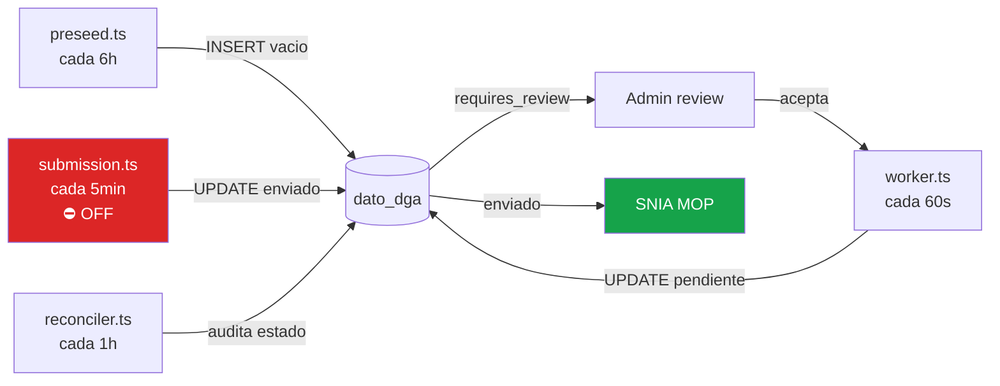

# DGA Workers — main-api

← [[HOME]] | Ver también: [[dga-setup]] · [[servicios]] · [[variables-entorno]]

---

## Mapa de workers



---

## Worker 1 — Preseed (`preseed.ts`)

> [!info] Cadencia: cada 6 horas | Flag: `ENABLE_DGA_PRESEED_WORKER=true`
> **Qué hace:** genera slots `dato_dga` con `estatus='vacio'` para todos los pozos con `dga_activo=true`.
>
> **Lógica de anchor:**
>
> ```sql
> GREATEST(inicio_mes_actual, dga_fecha_inicio)
> ```
>
> Timezone: `Etc/GMT+4` (UTC-4 fijo, hora Chile sin DST).
>
> **Falla silenciosa si falta:**
>
> - `pozo_config.dga_activo = false`
> - `pozo_config.dga_periodicidad` NULL
> - `pozo_config.dga_fecha_inicio` NULL
> - `pozo_config.dga_hora_inicio` NULL
>
> Log de éxito: `DGA preseed: slots creados | site_id=S131 slots=720`

---

## Worker 2 — Fill (`worker.ts`)

> [!info] Cadencia: cada 60 segundos | Flag: `ENABLE_DGA_WORKER=true`
> **Qué hace:** lee `equipo_1min` y llena slots `vacio → pendiente` o `vacio → requires_review`.
>
> **Fuente de datos:** `equipo_1min` (continuous aggregate — delay ~2min).
>
> **Validaciones:**
>
> - `caudal > dga_caudal_max_lps * (1 + tolerance/100)` → `requires_review`
> - Nivel freático fuera de rango físico → `requires_review`
> - Sin datos en la ventana → slot permanece `vacio` (alert del reconciler si >6h)
>
> Log: `DGA fill: vacio → pendiente | site_id=S131 ts=2026-05-01T01:00:00`

---

## Worker 3 — Submission (`submission.ts`)

> [!danger] DESHABILITADO en prod — `ENABLE_DGA_SUBMISSION_WORKER=false`
> **Qué haría:** toma slots `pendiente` → los envía a SNIA MOP via REST → actualiza a `enviado`.
>
> Endpoint SNIA: `POST https://apimee.mop.gob.cl/api/v1/mediciones/subterraneas`
>
> **Para activar (cuando gerencia autorice):**
>
> 1. Verificar `dga_transport='rest'` en cada pozo
> 2. Cambiar flag en `~/emeltec3/.env`
> 3. Redeploy
>
> Ver [[dga-setup#Modo dga_transport]].

---

## Worker 4 — Reconciler (`reconciler.ts`)

> [!info] Cadencia: cada hora | Flag: `ENABLE_DGA_RECONCILER=true`
> **5 checks que realiza:**
>
> | Check | Condición                  | Acción                  |
> | ----- | -------------------------- | ----------------------- |
> | A     | Slot `enviando` > 15min    | Revertir a `pendiente`  |
> | B     | Audit OK pero estado drift | Corregir en DB          |
> | C     | `enviado` sin audit trail  | Alert solo (no corrige) |
> | D     | Doble submission           | Alert solo              |
> | E     | `vacio` stale > 6h         | Alert digest por email  |
>
> Log limpio: `DGA reconciler: ciclo OK sin hallazgos`

---

## Ver logs en vivo

```bash
cd ~/emeltec3
docker compose logs main-api --since 30m | grep -iE "dga|preseed|fill|submission|reconcil"
```
