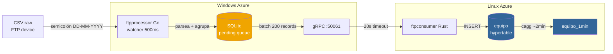

# FTP Dispositivos — REGADIO y CASINO

← [[HOME]] | Ver también: [[schema]] · [[dga-setup]] · [[quick-ref]] | Fuente: [[../ftp-pipeline]]

---

## Mapa del pipeline FTP



---

## Dispositivos registrados

> [!info] REGADIO — `25120112`
> ```
> sitio.id     = S131
> id_serial    = 25120112
> obra_dga     = configurada ✓
> Sensores     = Flujo Insta · Totalizado · Nivel Freat
> ```

> [!warning] CASINO — `25120225`
> ```
> sitio.id     = desconocido (verificar en DB)
> id_serial    = 25120225
> obra_dga     = NO asignada ✗ — esperar código DGA de empresa
> Sensores     = Flujo Insta · Totalizado · Nivel Freat · FREESPACE
> ```
> FREESPACE siempre filtrado por `shouldSkipName()` en `parser.go`.

---

## Formato CSV raw

> [!example] Ejemplo de archivo FTP
> ```csv
> fecha;hora;nombre_sensor;valor;unidad;quality
> 06-05-2026;11:26:00;Flujo Insta;0,0;l/s;G
> 06-05-2026;11:26:00;Totalizado;4915200;M3;G
> 06-05-2026;11:26:00;Nivel Freat;17,3;m;G
> ```
> - Separador: `;` · Decimal: `,` · Fecha: `DD-MM-YYYY`
> - `parser.go` convierte America/Santiago → UTC antes de insertar

> [!tip] Quality
> | Código | Significado | ¿Filtra ftpprocessor? |
> |---|---|---|
> | `G` | Bueno | No (ingresa a DB) |
> | `B` | Malo | **No — BUG pendiente** |
> | `-999` / `-999.000` | Sentinel | Sí (filtrado) |
>
> Pendiente: agregar `if row.Quality == "B" { continue }` en `BuildTelemetryRecords` (`parser.go`).

---

## Regla crítica del nombre de archivo

> [!danger] El archivo DEBE tener `_log_` en el nombre
> `SerialFromFilename` extrae el serial buscando el prefijo antes de `_log_`.
> ```
> ✅ REGADIO_log_20260501_20260531.csv   → serial = REGADIO → resuelve a 25120112
> ❌ REGADIO_mayo2026.csv               → serial = REGADIO_mayo2026 → no resuelve
> ```
> Sin `_log_`: el `id_serial` queda mal en DB, el dato DGA nunca se asocia al sitio.

---

## Datos cargados en DB

> [!success] REGADIO — estado actual
> | Período | Filas en `equipo` | Rango UTC |
> |---|---|---|
> | Mayo 2026 | ~19,336 | 2026-05-06 15:26 → 2026-05-31 23:30 |

> [!success] CASINO — estado actual
> | Período | Filas en `equipo` | Rango UTC |
> |---|---|---|
> | Mayo 2026 | ~730 | 2026-05-13 20:00 → 2026-05-31 23:30 |
>
> Solo timestamps con los 3 sensores quality G simultáneos (13–31 mayo).
> Antes del 13/05: Nivel Freat G, otros B → filtrados.

---

## Archivos pendientes de cargar

> [!todo] Pendientes — `C:\Users\cidm3\Downloads\datos`
> | Archivo | Período | Filas G est. | Prioridad |
> |---|---|---|---|
> | `POZO REGADIO TD_log_20241008_20241022.csv` | Oct 2024 | ~41,285 | Alta |
> | `POZO CASINO TD_log_20241004_20241022.csv` | Oct 2024 | ~48,139 | Alta |
> | `REGADIO_log_20260506_20260609.csv` | May–Jun 2026 | — | Media |
> | `CASINO_log_20260603_20260609_01.csv` | Jun 2026 | ~29,366 | Media |
>
> Ver [[pendientes]] para procedimiento completo.

---

## Procedimiento — carga histórica

> [!tip] Pasos para cargar un CSV
> ```powershell
> # 1. Filtrar mes específico (Windows local)
> .\filter-ftp-month.ps1 `
>   -InputFile "C:\Users\cidm3\Downloads\datos\REGADIO_log_original.csv" `
>   -OutputFile "C:\serverwin\REGADIO_log_20260501_20260531.csv" `
>   -Year 2026 -Month 5 -RequireAllSensors
>
> # 2. Copiar via RDP al Windows Server:
> # C:\Users\azureuser\Documents\serverwin\ftpprocessor\bin\data\incoming_ftp\
>
> # 3. Esperar log en ftpprocessor:
> # ok ftp (25120112) REGADIO_log_20260501_20260531.csv | attempt 1/3 | records: N | Xms
> ```

> [!tip] Verificar inserción en Linux
> ```bash
> docker exec emeltec-db psql -U postgres -d telemetry_platform \
>   -c "SELECT COUNT(*), MIN(time), MAX(time) FROM equipo WHERE id_serial = '25120112' AND time >= '2026-05-01' AND time < '2026-06-01';"
> ```

---

## Gotchas conocidos

> [!warning] `failed_files: 1` en log de ftpprocessor
> Apareció al cargar CASINO. Causa desconocida. Pendiente investigar en Windows Server.

> [!warning] gRPC timeout 20s
> Batch de 738 registros de CASINO tomó ~31s pero completó con retry. Configurado en ftpprocessor.

> [!warning] `equipo_1min` no es real-time
> Datos recién insertados en `equipo` **no aparecen en `equipo_1min`** hasta ~2 min después.
> Para verificar carga reciente, siempre consultar `equipo` directamente.

> [!info] Var de entorno ftpprocessor
> ```
> DEVICE_ALIASES=REGADIO:25120112,CASINO:25120225
> ```
> Esto es lo que permite resolver el nombre del archivo al `id_serial` correcto.
> El container receptor en Linux es `ftpconsumer` — ver [[servicios#Tabla de containers]].
