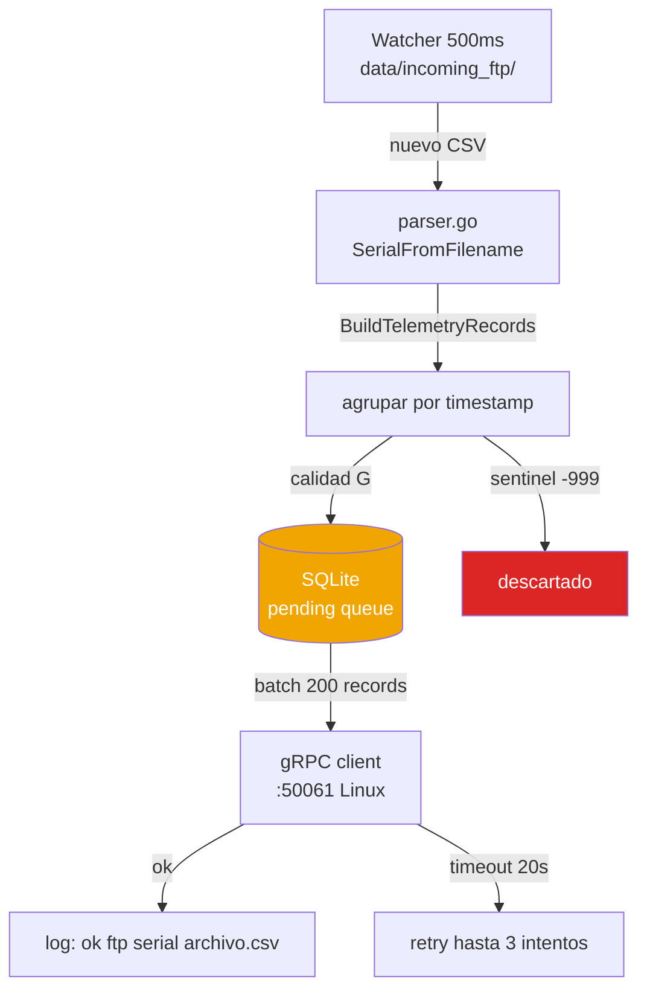

# ftpprocessor — Servicio Go (Windows Azure)

← [[HOME]] | Ver también: [[ftp-dispositivos]] · [[servicios]] · [[queries]]

---

## Arquitectura interna



---

## Archivos clave

| Archivo | Función |
|---|---|
| `internal/parser/parser.go` | Parsea CSV, extrae serial, filtra sentinels |
| `internal/ftpreader/reader.go` | Lee CSV 6 columnas semicolón |
| `internal/grpc/client.go` | Envía batch a ftpconsumer Linux |
| `data/incoming_ftp/` | Drop zone — watcher monitorea esta carpeta |

---

## `SerialFromFilename` — regla crítica

> [!danger] El nombre del archivo determina el `id_serial`
> ```go
> // Busca el prefijo antes de "_log_"
> // "REGADIO_log_20260501.csv" → "REGADIO" → resuelve via DEVICE_ALIASES → "25120112"
> // "REGADIO_mayo.csv" → "REGADIO_mayo" → no resuelve → id_serial incorrecto en DB
> ```
> **Sin `_log_` en el nombre: el dato queda huérfano.**

---

## `BuildTelemetryRecords` — lógica de parseo

```
1. Lee filas CSV (fecha;hora;nombre;valor;unidad;quality)
2. Filtra FREESPACE (shouldSkipName)
3. Filtra sentinels: -999, -999.0, -999.000 (isSentinel)
4. ⚠️  NO filtra quality B — BUG pendiente (ver [[pendientes]])
5. Convierte timestamp America/Santiago → UTC
6. Agrupa por timestamp: {ts → {sensor → valor}}
7. Solo emite grupos con los 3 sensores simultáneos (RequireAllSensors)
```

---

## Configuración (.env Windows Server)

```env
DEVICE_ALIASES=REGADIO:25120112,CASINO:25120225
GRPC_TARGET=145.190.8.19:50061
GRPC_TIMEOUT_SECONDS=20
INCOMING_FTP_DIR=data/incoming_ftp
```

---

## Logs esperados

```
ok ftp (25120112) REGADIO_log_20260501_20260531.csv | attempt 1/3 | records: 19336 | 284ms
failed ftp (25120225) archivo.csv | attempt 3/3 | error: context deadline exceeded
```

> Ver dispositivos conectados en [[ftp-dispositivos]].
> Para cargar datos históricos: [[ftp-dispositivos#Procedimiento — carga histórica]].
