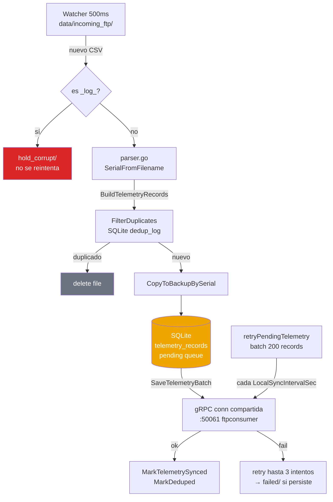

# ftpprocessor — Servicio Go (Windows Azure)

← [[HOME]] | Ver también: [[ftp-dispositivos]] · [[investigacion-latencia-2026-07-23]]

---

## Arquitectura interna


```mermaid
graph TD
    W[Watcher 500ms\ndata/incoming_ftp/] -->|nuevo CSV| LOG{es _log_?}
    LOG -->|sí| HC[hold_corrupt/\nno se reintenta]
    LOG -->|no| P[parser.go\nSerialFromFilename]
    P -->|BuildTelemetryRecords| DEDUP[FilterDuplicates\nSQLite dedup_log]
    DEDUP -->|duplicado| DEL[delete file]
    DEDUP -->|nuevo| BK[CopyToBackupBySerial]
    BK --> DB[(SQLite\ntelemetry_records\npending queue)]
    DB -->|SaveTelemetryBatch| GRPC[gRPC conn compartida\n:50061 ftpconsumer]
    GRPC -->|ok| MARK[MarkTelemetrySynced\nMarkDeduped]
    GRPC -->|fail| RETRY[retry hasta 3 intentos\n→ failed/ si persiste]

    RETRYLOOP[retryPendingTelemetry\nbatch 200 records] -->|cada LocalSyncIntervalSec| GRPC

    style DB fill:#f0a500,color:#fff
    style HC fill:#dc2626,color:#fff
    style DEL fill:#6b7280,color:#fff
```

---

## Archivos clave

| Archivo | Función |
|---|---|
| `cmd/ftpprocessor/main.go` | Entry point, watcher, workers, retry loop |
| `internal/parser/parser.go` | Parsea CSV, extrae serial, filtra sentinels |
| `internal/ftpreader/reader.go` | Lee CSV 6 columnas semicolón |
| `internal/localdb/store.go` | SQLite: dedup_log, telemetry_records, batch ops |
| `internal/sender/sender.go` | gRPC: `Dial()` (persistente) + `SendRecords()` |
| `data/incoming_ftp/` | Drop zone — watcher monitorea esta carpeta |

---

## `SerialFromFilename` — regla crítica

> [!danger] El nombre del archivo determina el `id_serial`
>
> ```go
> // Busca el prefijo antes de "_log_"
> // "REGADIO_log_20260501.csv" → "REGADIO" → resuelve via DEVICE_ALIASES → "25120112"
> // "REGADIO_mayo.csv" → "REGADIO_mayo" → no resuelve → id_serial incorrecto en DB
> ```
>
> **Sin `_log_` en el nombre: el dato queda huérfano.**

---

## `BuildTelemetryRecords` — lógica de parseo

```
1. Lee filas CSV (fecha;hora;nombre;valor;unidad;quality)
2. Filtra FREESPACE (shouldSkipName)
3. Filtra sentinels: -999, -999.0, -999.000 (isSentinel)
4. ⚠️  NO filtra quality B — BUG pendiente (ver [[backlog]])
5. Convierte timestamp America/Santiago → UTC
6. Agrupa por timestamp: {ts → {sensor → valor}}
7. Solo emite grupos con los 3 sensores simultáneos (RequireAllSensors)
```

---

## SQLite local — cola de durabilidad

Dos tablas:

| Tabla | Propósito |
|---|---|
| `telemetry_records` | Cola WAL: pending → synced. Permite retry si gRPC falla |
| `dedup_log` | Evita reenvíos: registra (id_serial, fecha, hora) de todo lo que se envió exitosamente. Retención 90 días. |

`FilterDuplicates` usa **row-value constructor** para aprovechar el PRIMARY KEY composite `(id_serial, fecha, hora)`:
```sql
WHERE (id_serial, fecha, hora) IN ((?,?,?),(?,?,?),...)  -- O(log n) con índice
-- NO: id_serial || '|' || fecha || '|' || hora IN (?)   -- O(n) full scan
```

`MarkDeduped` y `MarkTelemetrySynced` usan **bulk operations** para minimizar el tiempo que retienen la única conexión SQLite (`MaxOpenConns(1)`).

---

## Configuración (.env)

```env
DEVICE_ALIASES=REGADIO:25120112,CASINO:25120225
GRPC_ADDRESS=145.190.8.19:50061
GRPC_TIMEOUT_SECONDS=20
INCOMING_FTP_DIR=data/incoming_ftp
RAW_BACKUP_DIR=data/backup
FAILED_DIR=data/failed
HOLD_CORRUPT_DIR=data/hold_corrupt
SQLITE_PATH=data/ftpprocessor.db
NUM_WORKERS=4
WATCH_INTERVAL_MS=500
FILE_READY_AGE_MS=2000
RETRY_INTERVAL_SEC=60
LOCAL_SYNC_INTERVAL_SEC=5
STATS_INTERVAL_SEC=30
```

---

## Logs esperados

```
ftpprocessor iniciado | workers: 4 | watch: 500ms | ready: 2000ms | retry: 60s | consumer: 145.190.8.19:50061
ok ftp (REGADIO) REGADIO_20260723083519.csv | attempt 1/3 | records: 2 | 95ms
timing ftp (REGADIO) REGADIO_20260723083519.csv | read:2ms parse:1ms dedup:0ms backup:12ms sqlite:8ms grpc:68ms mark:4ms
skip log (REGADIO) REGADIO_log_20260501_20260531.csv | archivo historico movido a hold_corrupt
dedup ftp (REGADIO) REGADIO_20260723083519.csv | descartados: 2 duplicados
sqlite sync ok | records: 200
stats | procesados: 1173 | insertados: 2206 | fallidos: 23 | recuperados: 340400 | sqlite_pending: 135804
```

---

> Ver dispositivos conectados en [[ftp-dispositivos]].
> Investigación de latencia completa en [[investigacion-latencia-2026-07-23]].
> Para carga de datos históricos: [[ftp-dispositivos#Procedimiento — carga histórica]].
